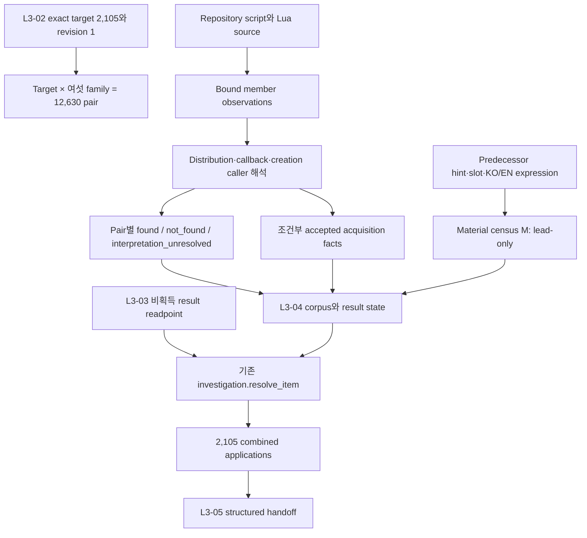
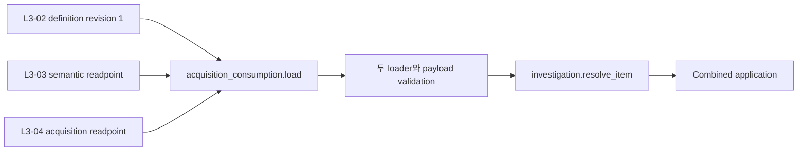

# Iris 획득 조사 결과 Walkthrough

작성일: 2026-09-05  
대상: 현재 세션에서 구현·검증·채택한 DVF-L3-04와 canonical 문서 정리

이번 작업은 exact case-sensitive FullType 2,105개의 item-global 획득 질문을 조사하고, 확인한 획득 경로와 아직 답을 확정할 수 없는 조사 결과를 L3-03과 독립된 off-live authority로 구축했다. 최종 결과는 current route에 채택됐으며 L3-05가 L3-03 비획득 결과와 함께 구조화해서 소비할 수 있다.

이 문서는 구현을 처음 읽는 사람이 입력에서 조사, fact admission, question state, 기존 resolver 결합까지 흐름을 따라가기 위한 설명이다. 규범적인 의미는 [획득 결과 계약](/C:/Users/MW/Downloads/coding/PZ/docs/iris_layer3_acquisition_contract.md), 정확한 subject·집계·실행 이력은 [closeout](/C:/Users/MW/Downloads/coding/PZ/docs/iris_layer3_acquisition_closeout.md)을 따른다. 이 문서는 새로운 authority, validator 또는 추가 gate가 아니다.

## 1. 출발점과 해결한 문제

L3-01은 하나의 item이 대표 의미 없이 `0..N`개의 독립 fact를 가질 수 있는 의미 계약을 제공한다. L3-02는 2,105개 target에 조사 profile, required axis, pending scope와 item 완료 공식을 적용했다. L3-03은 4,233개의 비획득 fact와 9,982개의 질문 결과를 별도 authority로 공급했지만 acquisition 결과를 소유하지 않았다.

DVF-L3-04가 해결한 문제는 “아이템을 어디서 얻는가”라는 문장을 채우는 일이 아니다. 실제 source에서 획득 경로와 조건을 확인하고, 확인된 fact의 존재와 조사 상태를 분리하며, 근거가 없는 획득 불가 판정을 막는 일이다.

구현에서 다음 네 상태를 서로 바꾸어 쓰지 않는다.

| 구분 | 의미 |
|---|---|
| Source observation | 선언, literal, distribution row, creation call, callback, caller 또는 조건을 실제 source에서 관찰한 기록 |
| Accepted acquisition fact | exact item, 실제 생성·전달 연결과 진실성에 필요한 조건을 독립 근거로 확인한 획득 경로 |
| Acquisition question state | 여섯 family 조사의 수행 여부와 승인 가능한 positive/negative 답변 존재 여부를 함께 계산한 결과 |
| Item investigation complete | L3-02의 모든 필수 axis, scope와 acquisition이 terminal일 때만 성립하는 기존 resolver 결과 |

문자열이 발견됐다는 사실은 획득 fact가 아니다. 반대로 하나의 확정 경로가 있고 그 경로의 진실성을 해치지 않는 다른 경로의 불확실성만 남았다면, 확인한 fact를 버리거나 질문을 임의로 unresolved에 고정하지 않는다.

## 2. 전체 데이터 흐름



공통 source는 한 번 관찰하고 여러 item/family pair가 같은 evidence를 참조한다. Pair는 exact item query와 해당 family에서의 발견·부재·미확정 해석을 별도로 가진다. 따라서 12,630개 pair를 위해 같은 원본을 2,105번 복제하지 않는다.

## 3. 구현 파일별 역할

| 구성요소 | 책임 |
|---|---|
| [acquisition_sources.py](/C:/Users/MW/Downloads/coding/PZ/Iris/tooling/src/iris_tooling/domains/layer3/acquisition_sources.py) | 여섯 family의 source member 수집, exact/unqualified identity lead, distribution·callback·creation trace, reviewed interpretation 및 조건부 positive path 생산 |
| [acquisition_results.py](/C:/Users/MW/Downloads/coding/PZ/Iris/tooling/src/iris_tooling/domains/layer3/acquisition_results.py) | Corpus 조립, fact/provenance identity, predecessor census, pair/result state 계산, negative admission, manifest 생산과 candidate/adopted loader |
| [acquisition_consumption.py](/C:/Users/MW/Downloads/coding/PZ/Iris/tooling/src/iris_tooling/domains/layer3/acquisition_consumption.py) | 실제 L3-03/L3-04 readpoint를 함께 검증하고 기존 resolver에 두 authority의 facts, results와 partial bindings를 전달 |
| [focused G1](/C:/Users/MW/Downloads/coding/PZ/Iris/build/description/v2/tests/test_layer3_acquisition_results.py) | V1–V11의 universe, 조사 admission, multiplicity, negative, predecessor, L3-03 보존, completion, identity와 registration을 하나의 identity로 검사 |
| [manifest](/C:/Users/MW/Downloads/coding/PZ/Iris/_docs/authority/dvf/layer3_acquisition_results/manifest.json) | Corpus, 구현, 계약, G1 source와 L3-02/L3-03 readpoint를 exact hash로 결속하는 채택 subject |

기존 L3-03 manifest가 결속한 `investigation.py`, `semantic_model.py`, `source_reader.py`, `semantic_results.py` 등은 수정하지 않았다. 새 모듈이 기존 함수를 import하는 additive 구조를 사용한다. Producer는 명시적인 repository root와 빈 repository-local output을 요구하며 composer, runtime writer 또는 product writer로 fallback하지 않는다.

## 4. 여섯 source family를 조사한 방식

최종 inventory에는 distinct source member 339개와 assessed interpretation trace 3,351개가 있다. 모든 required pair에서 미수행 trace는 0이다.

| Family | Members | Source에서 consumer까지 따라간 경로 | 남긴 경계 |
|---|---:|---|---|
| `loot` | 4 | Procedural item list → room/container의 procList 참조 → ordinary distribution → ItemPickerJava alias | Raw weight를 확률로 바꾸지 않으며 engine namespace lookup·loader precedence를 획득 fact로 추정하지 않음 |
| `vehicle` | 89 | Vehicle item list → container distribution → recursive alias → vehicle/container selection reference | Raw vehicle token을 사용자-facing 장소로 바꾸지 않으며 engine selection과 namespace를 열어 둠 |
| `foraging` | 23 | Static definition 및 검토한 10개 literal generator loop → effective default/category → loot table → icon/callback → valid pickup → inventory 또는 ground | Zone, month, perk, recipe, trait, tagged tool, square, callback, action validity와 random branch를 조건으로 보존 |
| `fishing_trapping` | 25 | Fish/trash record와 개별·공통 lure → fishing selection/line check → exact creation/delivery; Animal record → bait/trap/zone/time/freshness/random capture → checked recovery | Raw weight를 실제 확률로 계산하지 않고 world stock·action·random outcome을 전제로 유지 |
| `dynamic` | 160 | Creation/return/stash/message call → enclosing function → local assignments/guards → named caller와 action dispatch | Preview, 기존 객체 이동, debug/admin/test injection, symbolic type, engine message를 ordinary acquisition과 구별 |
| `transformation` | 313 | Script Result/Replace/OnCreate/LuaCreate → exact callback source lookup → action 또는 RecipeManager consumer | Unqualified result, callback 이름만의 추정, engine-only transformation을 fact로 승격하지 않으며 Layer 4 절차를 복제하지 않음 |

`CALLER_READINGS`는 단순 파일 allowlist가 아니다. 각 trace는 실제 함수, 생성 표현, assignment, guard, caller와 source-specific 해석을 함께 가진다. 검토하지 않은 trace가 남아 있으면 해당 family pair를 `found`, `not_found`, `interpretation_unresolved`와 같은 수행 완료 outcome으로 표시할 수 없다.

## 5. Pair outcome과 질문 상태

Pair outcome은 다음 다섯 값으로 닫혀 있다.

| Outcome | 조사 충족 | 처리 |
|---|---|---|
| `found` | 충족 | Exact identity lead뿐 아니라 필요한 source member와 consumer 연결을 조사했고 확정 경로가 존재 |
| `not_found` | 충족 | Bound source와 consumer 범위를 실제 조사했지만 exact identity lead가 없음. 획득 불가를 뜻하지 않음 |
| `interpretation_unresolved` | 충족 | 필요한 조사는 수행했으나 namespace, symbolic value, engine receiver 또는 조건 때문에 답을 승인할 수 없음 |
| `access_failure` | 미충족 | 필요한 member에 접근하지 못함 |
| `not_attempted` | 미충족 | 필요한 의미 조사를 수행하지 않음 |

Item-global acquisition result는 여섯 pair를 함께 본다.

```text
family 중 하나라도 미수행
  → not_investigated

모든 family 수행 + accepted positive 또는 정당한 closed-negative 존재
  → resolved

모든 family 수행 + 승인 가능한 답변 없음
  → investigated_unresolved
```

최종 결과는 다음과 같다.

| 항목 | 결과 |
|---|---:|
| Exact target | 2,105 |
| Required item×family pair | 12,630 |
| Acquisition `resolved` | 1,025 |
| `investigated_unresolved` | 1,080 |
| `not_investigated` | 0 |
| Accepted positive facts | 1,057 |
| Accepted negative facts | 0 |
| 복수 경로·조건을 가진 item | 19 |
| 복수 provenance occurrence를 가진 동일 fact | 1 |
| Combined item complete | 0 / 2,105 |

`resolved` 1,025개는 모든 획득 경로를 찾았다는 뜻이 아니다. 조건까지 확인한 답변이 적어도 하나 존재한다는 뜻이다. `investigated_unresolved` 1,080개는 미수행이 아니라 실제 조사 후 승인 가능한 positive/negative 답변을 얻지 못한 상태다. Acquisition의 미수행은 0이지만 다른 L3 axis가 열려 있으므로 item complete는 0이다.

## 6. Accepted fact와 provenance

Positive fact는 exact `item_id`, `route`와 fact-local `conditions`를 가진다. Route와 조건이 달라지면 다른 semantic fact다. 같은 의미가 다른 source occurrence에서 확인되면 fact를 복제하지 않고 provenance를 병합한다.

Fact ID는 L3-03의 content identity 규칙을 재사용한다. Source locator, review metadata와 serialization 순서는 fact 의미에 포함하지 않는다. Provenance는 source path/hash, locator, raw observation, reviewed rule, exact item과 fact proposition을 결속한다. Open result의 terminal `fact_refs`는 비우고, 독립적으로 확인한 fact는 `fact_question_bindings`의 partial contribution으로 보존할 수 있다.

생산된 fact 구성은 다음과 같다.

| Reviewed rule | Fact 수 |
|---|---:|
| Foraging 및 crop-seed | 1,007 |
| Fishing | 10 |
| Trapping | 5 |
| 조건별 new-player inventory | 21 |
| Broad recovery, incidental output, replacement | 14 |

## 7. 대표 사례로 읽는 판정 경계

### `Base.Worm`: 확인한 모든 경로를 보존

Worm에는 서로 다른 세 경로가 있다.

1. Foraging definition과 category/item 조건을 통과해 회수하는 경로
2. 유효한 farming plot을 plow한 뒤 `ZombRand(5) == 0`일 때 inventory에 추가되는 경로
3. 유효한 bag과 ground 조건으로 흙을 판 뒤 `ZombRand(5) == 0`일 때 inventory에 추가되는 경로

세 경로는 전제와 route가 다르므로 하나의 대표 경로로 합치지 않는다. Random 값을 실제 확률·효율·추천으로 바꾸지도 않는다.

### `Base.Generator`: world object 회수

Context menu caller가 접근 가능한 generator를 `ISTakeGenerator`에 전달한다. Action validity는 object index가 유효하고 generator가 연결되어 있지 않을 것을 요구한다. 완료 시 exact `Base.Generator`가 inventory에 들어가고 condition과 양의 fuel이 복사되며 두 손에 장착된다. 이 fact는 world에 generator가 항상 존재한다거나 회수가 항상 성공한다는 뜻이 아니다.

### `Base.BookTrapping1`: 강한 lead도 fact와 다르다

Procedural distribution과 `PostalTruckBed`에서 item token을 찾았고 predecessor KO/EN 문장에는 학교·서점·도서관·가정집 책장·책 상자·우체국·우편 차량의 일곱 장소가 있다. 그러나 ItemPickerJava의 exact namespace·spawn 연결을 이 source snapshot만으로 닫지 못했다. 따라서 실제 조사는 완료했지만 accepted acquisition fact는 0이고 결과는 `investigated_unresolved`다. 기존 문장을 새 source truth로 재사용하지 않았다.

### `Base.EngineParts`: 주석과 활성 경로를 분리

`ISTakeEngineParts.lua` 안의 직접 `AddItems` 블록은 Lua block comment 안에 있어 생성 근거에서 제외했다. 활성 경로는 client의 `sendClientCommand('vehicle', 'takeEngineParts')`에서 server `VehicleCommands.Commands.takeEngineParts`로 이어진다. Server는 vehicle/Engine part를 찾고 condition과 skill-derived random divisor로 `numParts`를 계산하며, 값이 양수일 때 exact `Base.EngineParts`의 `addItemOfType` object-change message를 보낸다.

두 source와 locator, 활성 조건은 trace에 결속했다. 그러나 repository에 없는 engine message receiver를 실제 inventory delivery로 추정하지 않았기 때문에 이 경로 자체를 accepted fact로 만들지 않았다.

### Exact identity anomaly

`Base.Bag_PistolCase`, `Base.Lemongrass`, `Base.NoiseMaker`는 exact declaration이 0개다. `Base.ShotgunCase1`은 두 선언이 있고 loader winner를 확정할 수 없다. 비슷한 이름에 `Base.`를 붙이거나 임의 선언을 선택하지 않았으며, 네 item은 fact 0과 `investigated_unresolved`를 유지한다.

## 8. Negative가 0인 이유

검색 miss는 `acquisition_unobtainable`의 근거가 아니다. Negative fact에는 item-global acquisition enumeration, 모든 family/source closure, dynamic·engine omission 배제, bound closure observation과 positive contradiction 부재가 모두 필요하다.

현재 repository snapshot은 engine/runtime와 외부 registry까지 닫힌 전수 열거를 제공하지 않는다. 따라서 accepted negative는 0개다. G1은 완전히 닫힌 작은 synthetic fixture에서 valid negative를 확인하고 source miss, partial closure 및 positive contradiction을 거부한다. 그 fixture는 실제 게임 item의 근거나 새 validation authority로 사용하지 않는다.

## 9. Predecessor material을 다루는 방식

Predecessor hint와 product 문장은 discovery material일 수 있지만 successor fact source가 아니다. Material census M은 input hash, item, kind, locator와 locale로 occurrence identity를 만든다.

| Material | Occurrence |
|---|---:|
| Nonempty acquisition hint | 1,105 |
| Acquisition source-slot | 68 |
| Product acquisition-role leaf | 4,210 |
| Product expression surface | 2,895 |
| 전체 M | 8,278 |

모든 record의 disposition은 `lead-only`다. Book source-slot subset B는 55개이고 H와의 교집합도 55개다. 나머지 13개 non-Book acquisition slot도 M에서 삭제하지 않았다. Empty role-ref array를 그대로 보존하면서 실제 KO/EN expression을 별도로 수집했기 때문에 typed ref가 비어 있어도 공개 문장을 놓치지 않는다.

`Base.BookTrapping1`의 KO/EN Menu에서 일곱 장소 claim span을 각각 보존해 비교했으며 실제 paired Menu claim mismatch는 0이다. 이는 predecessor 문장끼리의 대응 결과일 뿐, 일곱 장소를 successor acquisition fact로 채택했다는 뜻이 아니다.

## 10. L3-03과 결합 소비

L3-04는 L3-03 corpus 안에 병합되지 않는다. 두 authority는 고유 ID, manifest와 lifecycle을 유지한다.



Candidate payload는 in-memory helper를 사용할 수 있지만 adopted payload는 실제 검증된 readpoint와 loader를 거쳐야 한다. Mode 혼합, authority ID 충돌, target mismatch와 duplicate question을 거부한다. L3-03의 `application_inputs`를 사용하므로 기존 routing, pending scope, gap과 first-contact를 다시 생산하지 않는다.

G1은 standalone L3-03과 combined application에서 acquisition을 제외한 projection이 같은지 확인했다. L3-03의 4,233 facts, 9,982 results 및 partial bindings는 보존됐다. L3-04를 결합해 acquisition 미수행이 0이 되어도 다른 open axis 때문에 item complete는 0이다.

L3-05의 readpoint는 다음 호출이다.

```python
from iris_tooling.domains.layer3 import acquisition_consumption

handoff = acquisition_consumption.load(
    repository_root,
    acquisition_manifest_binding,
    mode="adopted",
)
```

`handoff`에는 두 readpoint와 corpus, fact-local conditions, provenance, question limitations와 2,105개의 resolver application이 들어 있다. L3-05는 raw acquisition source를 다시 조사하지 않고 이 구조화 입력을 표현·omission 판단에 사용할 수 있다.

## 11. 채택과 검증 이력

최종 [acquisition manifest](/C:/Users/MW/Downloads/coding/PZ/Iris/_docs/authority/dvf/layer3_acquisition_results/manifest.json)의 SHA-256은 다음과 같다.

```text
0281e7db661d2c37984568b715e53c97a3e78234b95b9fdfbb59ea1e31fa2a29
```

Corpus SHA-256은 `4293d715305978f4fec5b6643501cf73884e58dd4aec3e8692928b8880502512`다. Corpus bytes는 candidate lifecycle을 유지하고 current route, authority entry와 exact successful closeout이 logical adoption을 소유한다.

계획의 한 required identity는 다음이다.

```text
test_layer3_acquisition_results.Layer3AcquisitionResultsTest.test_acquisition_results_contract
```

Candidate G1 명령은 다음과 같았다. 아래는 실행 이력이며 이 walkthrough 작성 중 재실행하지 않았다.

```powershell
$env:PYTHONPATH = (Join-Path (Get-Location) 'Iris/tooling/src')
$env:PYTHONDONTWRITEBYTECODE = '1'
$env:UV_CACHE_DIR = (Join-Path (Get-Location) '.tmp/acquisition/cache')
$env:IRIS_REPOSITORY_ROOT = (Get-Location).Path
$env:IRIS_LAYER3_ACQUISITION_MODE = 'candidate'
uv run --project .\Iris\tooling --no-sync python -m pytest .\Iris\build\description\v2\tests\test_layer3_acquisition_results.py -q -p no:cacheprovider --round3-contract=diagnostic --round3-additional-source=Iris/build/description/v2/tests/test_layer3_acquisition_results.py
```

첫 final G1은 engine boundary를 기록한 trace에서 테스트가 특정 단어를 기대해 exit 1이었다. 실제 trace의 의미에 맞게 해당 단언을 수정하고 변경된 test member를 manifest에 재결속했다.

- Candidate 최종 결과: **exit 0, `1 passed, 14 subtests passed in 9.27s`**
- Adopted 연결 결과: **exit 0, `1 passed in 5.32s`**

Adopted mode는 source production과 fixture suite를 반복하지 않고 실제 route/authority/required membership, 두 adopted loader 및 combined resolver 연결만 확인했다. 기존 보호 경로 330개와 shared registration projection을 비교했다. 성공 후 추가 confidence 테스트를 실행하지 않았다.

Current authority manifest와 route index, `Iris/validation/execution/required_validations.json`, active `round3_pytest_source_classification.json`에 각각 한 건을 additive하게 등록했다. 기존 entry와 historical registry는 유지했다.

## 12. Canonical 문서와 다음 단계

현재 세션에서는 구현과 채택 후 다음 문서를 current 상태에 맞췄다.

- [DECISIONS.md](/C:/Users/MW/Downloads/coding/PZ/docs/DECISIONS.md): L3-04의 fact/state 분리, complete/adopted 상태, P4 복구 정책과 L3-05/06 소유권 경계를 기록했다.
- [ARCHITECTURE.md](/C:/Users/MW/Downloads/coding/PZ/docs/ARCHITECTURE.md): 세 신규 모듈, 두 result authority와 기존 resolver의 데이터 흐름, candidate/adopted 소비 경계를 반영했다.
- [ROADMAP.md](/C:/Users/MW/Downloads/coding/PZ/docs/ROADMAP.md): L3-04를 Done으로 옮기고 후속 범위를 문제 5~6으로 좁혔다.

L3-03 단독 소비에서는 acquisition 2,105개가 미조사였다. 현재 L3-04 결합에서는 acquisition `not_investigated=0`이지만 `investigated_unresolved=1,080`과 다른 L3 open axis가 남아 있다. 이 둘을 item complete나 제품 준비 완료로 바꾸지 않는다.

다음 단계인 DVF-L3-05는 adopted L3-03/04 facts, conditions, provenance, open questions, first-contact와 omission 정보를 사용해 Menu expanded detail 및 Tooltip-first S2의 KO/EN 표현을 구성한다. DVF-L3-06은 runtime/current product adoption을 소유한다. 이번 작업은 product corpus, composer, KO/EN Menu/Tooltip, Lua runtime, generation pointer, package/install을 전환하지 않았다.

Walkthrough 작성과 세 canonical 문서 정리에서는 테스트, corpus 재생산 또는 추가 검증을 실행하지 않았다. `.tmp/acquisition/`의 baseline, 이전 candidate와 cache는 일회성 실행 보조 자료이며 adopted 소비의 입력이나 정규 검사기로 승격하지 않는다.
