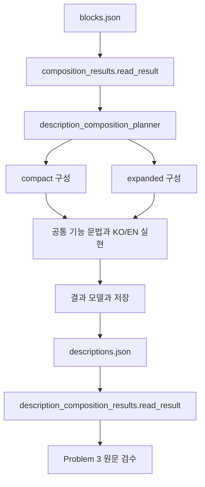

# Iris DVF 설명 조합 Walkthrough

> 작성일: 2026-09-10  
> 상태: **DVF-COMPOSITION-2 / Problem 2 complete — offline 공통 조합기와 Problem 3 검수 입력 확보**  
> 범위: 의미 블록의 KO/EN compact·expanded 구성, 결과 저장·읽기, 공통 표현 수정 및 핵심 문서 동기화

이번 세션에서는 Problem 1의 의미 블록을 받아 실제 한국어·영어 설명을 구성하는 공통 조합기를 구현했다. 2,105개 아이템의 두 언어·두 표면에 해당하는 8,420개 상태와 원문을 저장했으며, Problem 3은 이 결과를 재생성 없이 읽고 검수할 수 있다.

최종 집중 검사는 exit `0`, `1 passed in 4.53s`였다. 감독 검토에서 지적한 점화 반복, 물 사용의 수치·절차 누적, 조명 자체 상태 전환의 상세 누적을 공통 규칙으로 수정한 범위에서 완료를 수락받았다. 전체 원문의 자연스러움·간결성·번역체 수락과 실제 PZ 표시·B/C 제품 수락은 남아 있다.

이 문서는 구현 흐름과 수행 결과를 설명한다. 채택한 [계획](iris_dvf_description_composition_plan.md), [표현 계약](iris_dvf_description_composition_contract.md), [완료 보고서](iris_dvf_description_composition_closeout.md)를 연결하며, 새 검사 기준이나 adoption authority를 만들지 않는다. 이 Walkthrough 작성 중 테스트·결과 재생성·제품 전환은 실행하지 않았다.

## 1. 출발점과 해결할 문제

Problem 1은 r6의 accepted 사실을 기능·역할·맥락·조건·결과·획득 대안이 연결된 의미 블록으로 제공했다. 이번 입력은 [blocks.json](../Iris/build/description/composition/blocks.json)이며, 2,105개 아이템·29,202개 fact·10,304개 block을 포함한다. 의미 구성의 배경은 [Problem 1 Walkthrough](iris_layer3_composition_walkthrough.md)를 따른다.

의미 블록이 준비됐다고 사용자 설명까지 완성되는 것은 아니다. 블록마다 문장을 하나씩 붙이면 같은 역할이나 조건을 반복하고, 개별 실행 절차가 첫 설명에 누적된다. 반대로 짧게 만들려고 대표 용도 하나를 고르거나 조건을 지우면 의미를 잃는다. 이번 조합기는 다음 책임을 맡았다.

- Compact에는 기능과 역할의 개요를 구성하고, expanded에는 해당 용도의 상세와 정확한 국소 조건을 실제 문장으로 제공한다.
- 두 표면은 같은 의미 입력에서 각각 구성한다. Expanded를 문자 수로 잘라 compact로 만들지 않는다.
- 문장 병합·분할과 반복 생략을 하더라도 원래 역할·관계 방향·획득 대안·qualifier 적용 범위를 유지한다.
- 정상 부재와 규칙 실패를 구별하고, 검수자가 원문에서 근거로 이동할 수 있는 연결을 남긴다.

기존 r6 완성 설명을 다시 선택하거나 런타임에서 문장을 요약하는 방식은 사용하지 않았다.

## 2. 구현 흐름과 파일의 역할



구현 파일은 모두 `Iris/tooling/src/iris_tooling/domains/layer3/`에 있다.

| 파일 | 역할 |
| --- | --- |
| [description_composition_planner.py](../Iris/tooling/src/iris_tooling/domains/layer3/description_composition_planner.py) | 의미 단위와 조건 적용을 보존하고 개요/상세 배치를 결정한다. |
| [description_composition_families.py](../Iris/tooling/src/iris_tooling/domains/layer3/description_composition_families.py) | 역할 개요, 기능과 결과, 점화·물·독서·치료 등의 공통 문장 구성을 담당한다. |
| [description_composition_lexicon.py](../Iris/tooling/src/iris_tooling/domains/layer3/description_composition_lexicon.py) | 사용자 어휘와 조건의 개요 통합·요약·상세 배치를 제공한다. |
| [description_composition_ko.py](../Iris/tooling/src/iris_tooling/domains/layer3/description_composition_ko.py) | 한국어 조사·호응·병렬 표현과 조건 연결을 처리한다. |
| [description_composition_en.py](../Iris/tooling/src/iris_tooling/domains/layer3/description_composition_en.py) | 영어 관사·주어·동사구 병렬과 조건 연결을 처리한다. |
| [description_composition_model.py](../Iris/tooling/src/iris_tooling/domains/layer3/description_composition_model.py) | 결과 schema, identity, 표면 상태와 의미 연결의 구조 계약을 정의한다. |
| [description_composition_results.py](../Iris/tooling/src/iris_tooling/domains/layer3/description_composition_results.py) | 입력 소비, 두 표면의 실현, 전체 생산, 저장 및 독립 reader를 제공한다. |

기존 표현 모듈의 어휘 사전과 획득 표현 함수는 참고하지만, r6 producer나 완성 설명의 선택 규칙을 호출하지 않는다. KO/EN은 공통 의미 계획을 각 언어의 문법으로 실현하며, 한 언어의 완성 문장을 다른 언어의 번역 입력으로 삼지 않는다.

## 3. 의미를 유지하면서 문장을 조합하는 방법

### 역할과 조건의 범위

Context와 role은 같은 branch에 있고 조건 집합까지 같은 경우에만 하나의 주장으로 묶는다. 조건이 다르면 context를 역할의 지시 대상으로 사용하되 별도 주장을 유지한다. Expanded의 조건 반복도 정확히 같은 qualifier 범위 안에서만 줄인다.

Compact의 짧은 표현은 역할과 용도를 설명한다. 다른 물품을 수리하는 도구와 그 자체가 수리 대상인 물품을 구별하고, 국소 조건을 가진 문장을 다른 조건의 문장과 기계적으로 병렬화하지 않는다. 예상하지 않은 추가 조건이 있으면 해당 기능의 닫힌 문장 규칙을 적용하지 않고 일반 조건 보존 경로로 돌아간다.

기능과 효과를 합칠 때는 실제 result 관계를 확인한다. 창낚시 14개 대상의 마모는 인과가 미확정이므로 낚시 결과로 합치지 않고 독립 서술한다.

### 개요와 상세의 배치

같은 역할의 활동들은 명시된 이름을 유지하며 병렬화한다. 개별 제작 결과와 물품 자체의 유지관리·운영 절차는 상세에 둔다. 그러나 효과라는 종류만으로 모두 상세에 보내지는 않는다. 기술서의 경험치 배율, 시비의 성장/부패 분기, 흡연가 여부에 따른 상반된 효과, 오염수 음용 위험처럼 개요를 이해하는 데 필요한 의미는 남긴다.

Compact에서 상세로 배치한 내용은 expanded의 실제 문장에 연결한다. 사실 ID만 남기거나 expanded가 실패했는데도 상세 보존이 끝났다고 처리하지 않는다.

## 4. 실제 원문 검토에서 수정한 공통 규칙

| 대상 | 발견한 문제와 최종 처리 |
| --- | --- |
| Plank·Hammer | 역할 문장과 용도 문장의 반복을 활동별 재료/도구 역할과 용도 명사구로 합쳤다. 특정 제작 결과와 못·판자 반환 등의 절차는 상세에 뒀다. |
| Notebook | 열람, 기록 저장, 잠금 변경의 서로 다른 조건을 보존했다. 편집 잠금 해제 조건을 잠금 변경 자체에 확대하지 않았다. |
| 연료·불쏘시개 | 영어에서 점화 도구가 연료 사용에도 필요한 것처럼 읽히는 결합을 수정했다. 점화 도구 조건은 불쏘시개에만 붙는다. |
| 의류·Molotov | 의류 세척 결과는 명시적 관계로 묶었다. Molotov에는 입력에 없는 화염 효과를 발명하지 않았다. |
| 독서·시비·흡연·Bellows | 실제 결과 관계 아래에서 배율·성장/부패·특성별 효과·화로 열과 지구력 소모를 구성했다. |
| 차량·지면 작업·총기 | 설치/제거, 엔진 상태, 작업 대상과 사전 조건이 다른 기능 전체에 확대되지 않게 했다. |

최종 Plank compact는 다음과 같다.

> 건축·금속 가공·목공에 쓰는 재료이며, 차량 밖 근접 공격, 머리·몸통 외 골절의 부목 적용에 쓰거나 연료로 소모할 수 있다.

> It serves as a material for construction, metalworking, and woodworking, can be used for melee attacks outside a vehicle and splinting fractures outside the head and torso, and can be consumed as fuel.

상세에는 가구 부품·부목 제작의 재료 역할, 개별 제작 조건, 다른 용도가 실제 문장으로 남아 있다. 이 예문은 고정 정답이나 FullType별 수작업 대체문이 아니다.

### 감독 검토 후 완료 판단을 정정한 부분

최초 완료 보고 뒤 점화와 물 용기에 공통적인 반복·상세 누적이 남아 있다는 지적을 받았다. 이를 물리 화면 측정의 문제로만 넘기지 않고 구현 완료 판단을 보류한 뒤 공통 배치 규칙을 수정했다.

점화 도구 9개에서는 대상마다 휘발유/불쏘시개를 반복하는 대신 공통 점화 목적 아래 실제 대상들을 모았다. 대상별 점화 수단·준비·소모 여부는 서로 다른 expanded 문장에 유지한다. 모든 대상에 모든 수단을 허용한다는 의미는 만들지 않는다.

물 용기 49개에서는 보관·운반과 담긴 물의 사용 목적을 조합했다. 중독 수치, 물 저장 시설 보충 절차, 쌀·파스타 준비는 상세에 두고 오염수 위험은 compact에 남겼다. WaterPot의 최종 원문은 다음과 같다.

> 물을 보관·운반하며, 담긴 물은 작물 급수·차량 혈흔 세척·소화·갈증 해소에 쓸 수 있다. 오염된 물을 마시면 중독될 수 있다. 조리 재료 추가에 쓰는 바탕 재료다.

> It can store and carry water for crop watering, washing vehicle bloodstains, fire extinguishing, and quenching thirst. Drinking tainted water can cause poisoning. It is a preparation base for adding cooking ingredients.

후속 검토에서는 조명 자체의 상태 전환 상세도 정리했다. 초의 점화·소화 제작법, 손에서 빼거나 버릴 때의 형태 변경을 상세에 두고, 휴대 조명 조작 기능이 있는 물품의 활성화 토글과 건전지 운영도 상세로 배치했다. 다른 초의 점화에 쓰는 도구 역할은 유지한다.

CandleLit의 최종 compact는 다음과 같다.

> 바비큐·모닥불·통나무 드럼·벽난로·연료가 있는 화로·시신·초의 점화에 쓰는 도구다. 손에 들거나 장착한 상태에서 휴대 조명을 조작할 수 있다.

> It is a tool for lighting barbecues, campfires, drums containing logs, fireplaces, fueled furnaces, corpses, and candles. It offers portable-light controls while held or attached.

Candle/CandleLit/Lighter/Torch/HandTorch와 물 용기·점화 도구의 영향을 받은 KO/EN 원문을 읽었다. 실제 발광은 현재 상태에 달려 있다는 상세를 유지했으며 항상 빛난다고 주장하지 않았다. 감독 검토는 이 공통 결함 수정과 offline 인계 범위를 수락했다. ‘휴대 조명을 조작’의 자연스러움과 긴 대상 나열을 포함한 전체 원문 품질은 Problem 3의 검수 대상이다.

## 5. 저장된 결과와 검수 방법

검수 입력은 [descriptions.json](../Iris/build/description/composition/descriptions.json)이다. Schema는 `iris-layer3-descriptions-v1`이며, item마다 KO/EN의 compact·expanded를 제공한다.

| 표면 | KO present / absent / failed | EN present / absent / failed |
| --- | --- | --- |
| compact | 1,984 / 121 / 0 | 1,984 / 121 / 0 |
| expanded | 2,043 / 62 / 0 | 2,043 / 62 / 0 |

채택된 내용이 없는 62개와 획득 내용만 있는 59개를 구분한다. 획득 전용 59개의 실제 설명은 expanded에 있으므로 compact 부재는 121개다. 과거 설명의 공백 여부를 기준으로 복사한 상태가 아니다.

검수자는 다음 연결을 사용한다.

1. `items[].item_id`로 exact FullType을 찾는다.
2. `locales.ko` 또는 `locales.en`에서 표면의 상태·원문·segment를 읽는다.
3. Segment의 block/branch/fact/qualifier/relation refs로 원래 의미와 조건을 대조한다.
4. Compact의 `qualifier_dispositions`로 조건이 개요에 통합됐는지, 짧게 실현됐는지, 상세에 배치됐는지 확인한다.
5. `detail_links`가 가리키는 같은 locale의 expanded segment에서 상세 원문을 읽는다.

긴 qualifier는 item-level에 한 번 저장하며 정확한 application을 보존한다. 참조가 있다는 사실만으로 모든 조건이 compact 문장에 실현됐다고 해석하지 않는다. `present`도 자연어 품질의 최종 수락을 뜻하지 않는다.

`description_composition_results.read_result(root)`는 저장된 결과를 읽고 구조를 확인한다. 입력 reader와 producer를 호출하지 않으므로 검수를 위해 전체 결과를 다시 생산할 필요가 없다. 입력·생성기 식별 정보는 같은 결과 안에 있으며 별도 봉인 파일을 만들지 않았다.

## 6. 검증과 실행 범위

사용한 테스트 진입점은 계획 §7의 다음 명령 하나다.

```powershell
uv run --project .\Iris\tooling python -I -B -m pytest --noconftest -c .\Iris\tooling\pyproject.toml .\Iris\build\description\v2\tests\test_layer3_description_composition.py -q
```

최종 결과는 **exit `0`, `1 passed in 4.53s`**이며 명령은 약 5.2초 안에 완료됐다. 초기 fixture와 실제 원문에서 발견한 공통 규칙을 수정한 뒤 같은 진입점을 필요한 만큼 재실행했다. 각 실행은 전체 결과 하나의 생성·입력 직접 대조·저장·읽기를 공유했다. 세션 전체에서 생산을 단 한 번만 했다는 뜻은 아니다.

[집중 검사](../Iris/build/description/v2/tests/test_layer3_description_composition.py)는 작은 fixture의 병렬화·역할·조건 범위·대안·미확정 관계·실패 처리를 확인한다. 전체 결과에서는 입력의 사실과 조건 application을 직접 대조하고, 양언어 의미 연결과 expanded 보존을 확인한다. 저장 후 읽기는 producer와 입력 reader를 호출하지 못하게 한 상태에서 원문·상태·연결의 동일성을 확인한다.

테스트 실행에서 장기 실행이나 중단은 발생하지 않았다. 계획 밖 중간 테스트, 전체 suite, Lua/Java/JS·package·인게임 검사는 실행하지 않았다. 추가 검증 체계나 seal/receipt를 만들지 않았고 일회성 보조 검사를 canonical validator로 승격하지 않았다.

## 7. 문서 동기화와 인계 범위

구현과 함께 표현 계약·closeout을 작성하고 계획 상태를 완료로 갱신했다. 이후 사용자의 요청으로 다음 핵심 문서를 동기화했다.

| 문서 | 반영한 내용 |
| --- | --- |
| [DECISIONS.md](DECISIONS.md) | Problem 2 완료 결정, 공통 내용 배치, reader 인계와 수락 한계 |
| [ROADMAP.md](ROADMAP.md) | Problem 2 완료, Problem 3 전체 품질 검수와 B/C 실제 표시·제품 적용의 잔여 책임 |
| [ARCHITECTURE.md](ARCHITECTURE.md) | 의미 블록부터 planner·실현·저장·reader까지의 흐름과 모듈별 책임 |

기존의 ‘Problem 2는 후속 작업’이라는 현재 상태 문구를 정정하되 과거 완료 이력과 제품 경계를 유지했다. 문서 작성 때문에 이전 검사 결과를 새 PASS로 발행하거나 테스트를 재실행하지 않았다.

이번 작업은 입력 blocks, r6 원본·producer/adoption, L3-05/06 authority, 기존 제품 current, Tooltip/Menu/Lua/adapter/package를 변경하지 않는다. 기존 dirty 변경을 보존했으며 reset·commit으로 묶지 않았다.

Problem 3은 저장된 전체 원문의 자연스러움·간결성·번역체와 의미 보존을 검수한다. B/C는 실제 PZ 폰트·폭에서 최대 네 줄 요구와 제품 통합을 확인한다. `physical_fit`은 미측정이며 hard newline 부재·logical slot·임의 글자 수를 화면 적합성 증거로 사용하지 않는다. 이 범위를 유지한 채 추가 검사나 봉인 없이 세션 작업을 종료했다.

2026-09-11 Problem 3은 **partial**이다. 같은 scope의 명시적 qualifier overlap, compact 중복과 점화 역할 표현 등을 공통 규칙에서 교정했다. 전체 2,105개/8,420개 상태와 366개 current-input 부재를 회계하고 focused 검사 exit 0을 얻었으나 present 전수 item 조합 검수·장문 수습은 남는다. 이번 correction의 구현 계약은 [표현 계약](iris_dvf_description_composition_contract.md)의 bounded correction 절, 정확한 bytes·변경·미검수 좌표와 B/C 보류 경계는 [실행 기록](iris_dvf_description_quality_acceptance_closeout.md)을 따른다. 이전 Problem 2 완료와 실제 제품 current를 변경하는 기록이 아니다.
