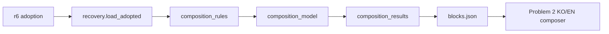

# Iris Layer 3 의미 구성 Walkthrough

> 작성일: 2026-09-10  
> 상태: **DVF-COMPOSITION-1 / Problem 1 complete**  
> 범위: 채택된 r6 Layer 3 사실을 locale-neutral 의미 블록으로 구성하고 Problem 2에 인계

이번 작업은 채택된 r6의 semantic/acquisition facts를 KO/EN 문장보다 앞선 의미 구조로 재구성했다. 결과는 기능·역할·대상·맥락·조건·결과의 관계를 보존하며, 후속 설명 조합기가 기존 문장을 파싱하거나 사실 관계를 다시 판단하지 않고 사용할 수 있다.

최종 consumer artifact는 `Iris/build/description/composition/blocks.json`이다. 이 결과는 repository-internal development/validation handoff이며 r6 원본·adoption, 제품 current route, Tooltip/Menu/Lua/package를 변경하지 않는다. 구현 계약과 정확한 완료 범위는 [composition contract](iris_dvf_semantic_block_integration_contract.md)와 [composition closeout](iris_dvf_semantic_block_integration_closeout.md)을 따른다. 이 walkthrough는 새 authority나 검증 gate를 정의하지 않는다.

## 1. 출발점과 해결한 문제

입력은 `Iris/_docs/authority/dvf/layer3_expression/successors/r6/adoption.json`이며 SHA-256은 `7dded22fad93b7eeff8debf56205cb9ee84220758d53ecb41396889fb49bd799`다. 기존 정상 `recovery.load_adopted` 경로가 exact FullType 2,105개에 결속된 semantic facts 28,145개와 acquisition facts 1,057개를 제공한다.

r6는 사실·조건·provenance와 KO/EN 표현을 보존하지만, 여러 사실을 한 설명에서 어떤 관계로 다룰지 Problem 2가 추측 없이 소비할 수 있는 공통 의미 구조는 별도로 필요했다. 다음 오판을 막는 것이 핵심이었다.

- Profile 이름이나 기존 문장 유사도로 대표 용도를 선택하는 것
- 같은 규칙이나 조건을 공유한다는 이유만으로 기능과 효과의 인과를 만드는 것
- 여러 branch에 걸친 조건을 item-global 조건으로 넓히는 것
- repair target을 tool로 바꾸거나 context-local role을 다른 맥락으로 이동하는 것
- 여러 획득 경로를 하나의 semantic function으로 섞는 것
- 모든 사실을 singleton으로 남겨 실제로 가능한 의미 통합을 회피하는 것

따라서 이번 완료 기준은 사실을 빠짐없이 담는 것뿐 아니라, accepted 근거로 확인되는 refinement·variant·result·compound·alternative를 실제로 구성하고 불충분한 관계는 명시적으로 보류하는 것이었다.

## 2. 입력에서 Problem 2 handoff까지



| 구성요소 | 책임 |
|---|---|
| `composition_rules.py` | accepted fact 사이의 관계, branch grouping, qualifier 귀속과 미확정 관계를 판정 |
| `composition_model.py` | schema, stable identity, fact conservation, relation/reference 및 qualifier scope 계약을 fail-closed로 검사 |
| `composition_results.py` | 정상 r6 소비, 전체 결과 생산, 저장과 Problem 2용 strict readback 제공 |
| `blocks.json` | 2,105개 대상의 blocks, branches, relations, qualifiers, separate inventory와 unresolved relation을 보존 |
| `test_layer3_composition.py` | 계획된 작은 의미 fixture와 한 번의 전체 생산·저장·readback을 묶은 focused 검사 |

`composition_results.produce(root)`는 adopted reader의 semantic/acquisition payload를 같은 실행에서 읽고 `composition_rules.compose()`에 전달한다. `write_result()`는 canonical JSON을 저장하며 기존 결과를 명시적 `replace` 없이 덮어쓰지 않는다. `read_result()`는 저장된 JSON을 읽어 `composition_model.validate_result()`를 통과한 구조만 반환한다.

Schema는 `iris-layer3-composition-v1`, contract version은 `1`이다. Block·branch·relation·qualifier identity는 item과 fact identity의 canonical content에서 계산하며 입력 배열 순서, prose 또는 Profile 순서에 의존하지 않는다.

## 3. 의미를 구성하는 순서

구성기는 각 item에서 condition/constraint qualifier와 의미 anchor를 먼저 분리한다. 이후 다음 순서로 처리한다.

1. 각 accepted anchor fact를 독립 branch로 시작한다.
2. Explicit `context_fact_ref`로 연결된 `context_role`을 해당 `use_context`의 방향 있는 refinement로 결속한다.
3. Source-grounded overlay가 허용한 context refinement, target variant, function/result와 compound 관계만 확인한다.
4. 확인된 관계의 branch를 같은 block에 묶되 branch identity와 방향은 그대로 유지한다.
5. Acquisition facts는 semantic block 밖의 acquisition block에 두고, 복수 경로를 조건·provenance가 보존된 alternative branch로 구성한다.
6. 같은 qualifier payload를 item 안에서 한 번 표현하면서 모든 원 fact/provenance/application ref를 합친다.
7. Qualifier가 한 block의 모든 branch를 덮으면 `block_common`, 일부 branch 또는 여러 독립 block만 가리키면 `branch_local`로 기록한다.
8. 관계 후보는 있지만 accepted 방향 근거가 없으면 block을 합치지 않고 `undetermined` relation과 consumer effect를 남긴다.
9. 마지막에 모든 accepted fact의 단일 disposition, reference 무결성, stable identity와 summary 일치를 검사한다.

내부 grouping에는 disjoint-set을 사용하지만, 자료구조 자체가 의미를 결정하지 않는다. Union은 위의 허용된 관계가 성립할 때만 수행된다. 같은 admission rule, qualifier, scope 또는 비슷한 이름만으로는 union하지 않는다.

## 4. 관계 유형을 읽는 방법

| 관계 | 의미 | Problem 2의 처리 경계 |
|---|---|---|
| `refinement` | 같은 역할 집합 아래 더 구체적인 context가 넓은 context를 세분 | 방향을 보존하고 필요하면 한 문장 또는 병렬 표현 가능 |
| `context_variant` | 공통 기능이 서로 다른 명시적 대상·맥락에 적용 | 대상별 predicate와 조건을 유지 |
| `result` | 특정 기능이 명시된 property/direction 효과를 낳는 source-grounded 대응 | 대응이 없는 효과에 인과를 확장하지 않음 |
| `compound` | note 작업처럼 함께 설명할 수 있지만 branch별 행동·조건이 남는 복합 의미 | 하나의 문장으로 만들 수 있어도 branch 조건을 섞지 않음 |
| `alternative` | 동일 item의 복수 획득 경로 | 어느 한 경로를 대표로 선택하거나 조건을 합치지 않음 |
| `equivalent` | 동일 qualifier payload가 여러 원 fact로 반복됨 | 문구는 한 번 표현할 수 있지만 전체 refs를 보존 |
| `undetermined` | 실제 관계 후보이나 현재 accepted 근거로 방향을 정할 수 없음 | 각 의미를 별도로 표현하고 관계·인과를 주장하지 않음 |

Function/result는 reusable exact mapping으로만 만든다. 현재 mapping은 washing, drinking, crop watering/treatment, burn cleaning, reading multiplier, floor glass, medical, drying, fertilizing, furnace bellows, smoking, splint application과 body washing에서 확인된 function/property/direction 대응을 포함한다. 이 목록은 item-name 예외가 아니라 accepted semantic values와 source/admission definition에 결속된 규칙이다.

Context refinement도 exact role-set equality를 요구한다. 예를 들어 `carpentry_menu_construction`은 같은 `material` 역할일 때만 `construction`을 refine한다. `smithing_parts`와 `shovel_smithing`도 동일한 역할 조건 아래에서만 `metal_forging`의 refinement가 된다. 추가 역할이 있으면 독립 branch로 남는다.

## 5. 조건과 qualifier의 소유권

Qualifier는 block 내부에 복제하지 않고 item-level record로 보존한다. Exact equal payload를 접어도 다음 정보는 잃지 않는다.

- 원 qualifier `fact_refs`
- 각 사실의 `provenance_refs`
- 조건이 실제로 적용되는 `applies_to_fact_refs`
- 계산된 `branch_refs`와 `block_refs`
- `block_common` 또는 `branch_local` scope

이 구조 때문에 Notebook의 writing implement 조건을 viewing이나 lock action 전체에 확대할 수 없다. 한 조건이 서로 다른 독립 block의 branch에 적용되더라도 그 사실만으로 block을 합치지 않는다. Problem 2는 공통 문구의 반복을 줄일 수 있지만, branch-local 조건을 모든 용도에 적용되는 조건처럼 표현해서는 안 된다.

`scope_unresolved`는 schema에 예약돼 있지만 정상 adopted r6 입력에서는 생성하지 않는다. r6가 이미 qualifier target을 검증하므로, composition 규칙 부족을 scope-unresolved라는 이름으로 숨기지 않는다.

## 6. 대표 사례

### `Base.Plank`

`carpentry_menu_construction`은 동일한 `material` 역할을 가진 `construction`의 refinement branch로 유지된다. Campfire와 hearth의 fuel 사용은 서로 다른 target variant이며 각 predicate를 보존한다. Splint application과 `splint_factor` 결과는 묶지만 splint removal은 별도 작업으로 남긴다. Woodworking, furniture, spear, trap, campfire-kit, metal-forging과 watermelon 관련 역할도 primary use 하나로 축소하지 않는다.

### `Base.Hammer`

Repair 의미의 역할은 `repair_target`이며 repair `tool`로 다시 쓰지 않는다. Shovel smithing은 같은 `tool` role 조건에서만 metal forging을 refine한다. Construction, woodworking, moving, barricade, melee, washing과 acquisition은 독립적으로 접근할 수 있다. 네 acquisition route는 각각의 조건을 가진 alternative branch다.

### `Base.Notebook`

Viewing, writing, page update, title update와 lock update는 하나의 compound note block 안의 다섯 branch다. Writing/page/title 및 lock qualifier는 원래 application ref를 유지하므로 writing 조건이 note의 모든 행동으로 넓어지지 않는다. Fuel과 tinder 용도는 note compound와 별도 block이다.

### `Base.Molotov`

Physics attack은 washing/blood-removal result block과 독립이다. Attack 조건은 washing으로 이동하지 않고 washing 조건도 attack에 적용되지 않는다. 공통 조건이나 admission을 공유한다는 사실만으로 두 의미를 합치지 않는 대표 사례다.

전체 적용 과정에서는 같은 source rule이나 조건을 공유한 기능·효과를 무조건 result로 연결하던 위험을 확인했다. 이를 exact source-grounded function/property/direction mapping으로 제한했고, focused fixture에 같은 rule·같은 condition이지만 관계가 없는 반례를 추가했다.

## 7. 전체 결과

최종 `blocks.json`의 크기는 27,555,498 bytes다.

| 항목 | 결과 |
|---|---:|
| Exact FullType targets | 2,105 |
| 입력 semantic facts | 28,145 |
| 입력 acquisition facts | 1,057 |
| Represented accepted facts | 29,202 |
| Residual / non-public | 0 / 0 |
| Meaning/acquisition blocks | 10,304 |
| Multi-branch grouped blocks | 1,591 |
| Block-common qualifiers | 9,430 |
| Branch-local qualifiers | 2,285 |
| Undetermined relations | 14 |

확정 관계 instance는 refinement 1,453, context variant 645, function/result 2,057, compound 4, acquisition alternative 19, equivalent qualifier 1,374다. 이 수치는 구현 규칙의 구조적 적용 횟수이며 통합률 목표, 품질 점수 또는 전 item 인간 의미 검수 결과가 아니다.

14개 undetermined는 spear-fishing 대상이다. 각 item에는 accepted `fish_with_spear` function과 `item_condition/decrease` effect가 있지만 두 사실을 연결하는 accepted application/direction ref가 없다. 두 의미는 모두 결과에 보존된다. Problem 2는 각각을 설명할 수 있으나 spear fishing이 condition loss를 일으킨다고 표현할 수 없다.

Prepared-food rename과 chef attribution, vehicle installation과 running wear, device headphone control과 media-code outcome처럼 단순히 rule이 같아 보이는 조합은 독립 block으로 유지했다. 이를 대규모 unresolved pair 목록으로 부풀리지 않았다.

## 8. 검증 실행과 한계

계획이 요구한 필수 자동 수락 진입점은 다음 하나였다.

```powershell
uv run --project .\Iris\tooling python -I -B -m pytest --noconftest -c .\Iris\tooling\pyproject.toml .\Iris\build\description\v2\tests\test_layer3_composition.py -q
```

최종 결과는 **PASS, exit `0`, `1 passed in 15.34s`**다.

Focused test는 정상 adopted load 한 번과 전체 producer 결과 하나를 공유했다. 같은 결과에서 fact conservation, relation/reference integrity, qualifier scope, 실제 positive grouping, 대표 위험 사례, durable write와 reader readback을 확인했다. 작은 in-memory fixture는 입력 순서 안정성, 허용된 grouping, 독립 의미, acquisition alternative, undetermined 처리와 invalid qualifier ref 거부를 다뤘다.

이 검사는 구조와 소비 계약을 확인하며 다음을 증명하지 않는다.

- 모든 relation의 전수 인간 의미 정확성
- upstream game fact 자체의 진위
- 최종 KO/EN 문장의 자연스러움과 전체 설명 품질
- Tooltip/Menu 표시, Lua runtime, package/install 또는 PZ 인게임 동작
- 제품 current 전환이나 release readiness

Repository-wide suite, historical replay, Run A/B comparator, validation registry/preflight, package/runtime test, adoption/seal과 추가 confidence run은 수행하지 않았다. 임시 검사 스크립트나 새 validation authority도 만들지 않았다. 이 walkthrough 작성과 세 canonical 문서 갱신을 위해 테스트를 다시 실행하지 않았다.

## 9. 세션 문서 반영

구현과 closeout 이후 current 문서 세 곳을 같은 경계로 갱신했다.

- [ARCHITECTURE.md](ARCHITECTURE.md): r6 adoption에서 composition artifact와 Problem 2 reader로 이어지는 책임·자료 흐름, 관계 및 qualifier 소유권을 추가했다.
- [ROADMAP.md](ROADMAP.md): Problem 1을 complete로 기록하고 Problem 2의 KO/EN 조합, Problem 3의 전체 품질 검수·제품 적용 판단을 다음 단계로 분리했다.
- [DECISIONS.md](DECISIONS.md): 의미 구성 완료, 허용 근거, 14개 undetermined의 consumer 제약과 제품 비전환 결정을 기록했다.

이 갱신은 과거 r6 bytes나 adoption을 수정하지 않는다. 정상 adopted 소비와 historical reproduction 검사는 이미 분리돼 있으며, 가변 architecture 문서의 현재 내용이 과거 생산 subject를 다시 정의하지 않는다.

## 10. 다음 작업의 시작점

Problem 2는 `composition_results.read_result()`로 `blocks.json`을 읽고 KO/EN 설명을 조합한다. Block 하나를 문장 하나나 화면 한 줄로 고정할 필요는 없다. 다음 표현 선택은 허용된다.

- 여러 branch를 한 문장에 병렬로 표현
- 긴 의미를 여러 문장으로 분할
- exact scope가 유지되는 공통 qualifier 문구의 중복 생략
- compact와 expanded에서 서로 다른 문장 구성 사용

반면 독립 block 삭제, representative `primary_use` 선택, relation 방향 변경, alternative route 통합, branch-local 조건 확대와 `undetermined`의 임의 확정은 금지된다. Problem 2는 의미 구조를 표현하는 책임이며 새 사실을 조사하거나 관계를 재판정하는 단계가 아니다.

Problem 3는 생성된 전체 설명의 가독성과 의미 보존을 검수하고 제품 적용 범위를 판단한다. 이번 Problem 1 완료를 이유로 그 품질 검수, Tooltip/Menu 연결 또는 current cutover를 완료로 간주하지 않는다.
