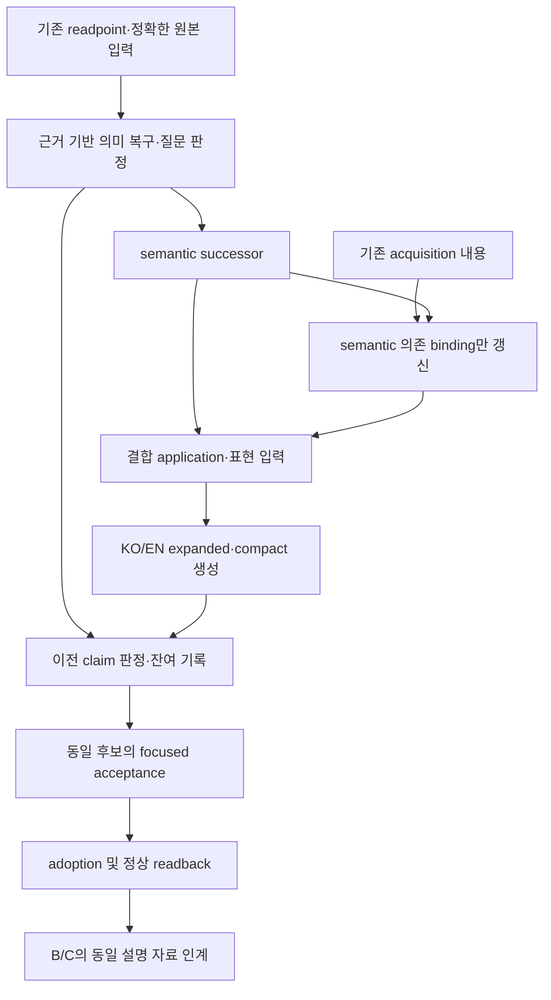

# Iris Layer 3 설명 복구·표현 정정 Walkthrough

작성일: 2026-09-09  
대상: 현재 세션에서 수행한 offline 설명 복구, r6 채택, 결과 문서 정리와 정상 소비 복구

## 1. 최종 결과

문제 A의 offline 설명 복구와 공통 표현 정정을 **r6로 완료·채택**했다. 같은 사실에서 한국어·영어의 상세 설명(expanded)과 첫 이해용 설명(compact/S2)을 생성하며, B와 C가 동일한 설명 자료를 참조한다. 문서 갱신으로 발생했던 입력 해시 불일치는 문서 배치를 조정해 수습했고, 현재 checkout의 정상 `load_adopted` 호출도 exit 0으로 완료했다.

이 완료는 실제 Tooltip·Menu 연결이나 모든 아이템 의미의 해소를 뜻하지 않는다. 문제 B(Tooltip S2 연결)와 문제 C(Menu 표현 연결)는 이 세션에서 착수하지 않았다.

| 결과 | 상태 |
|---|---|
| r6 설명 생성 | exit 0, `completion=complete` |
| 계획의 최종 focused acceptance | exit 0, `1 passed in 1295.39s (0:21:35)` |
| 동일 r6 채택 및 정상 adopted readback | exit 0 |
| 문서 변경 부작용 수습 후 현재 checkout의 정상 소비 | exit 0, `mode=adopted`, `targets=2105` |
| 제품 current·root route/index 전환 | 수행하지 않음 |
| B/C 제품 구현 | 미착수 |

계획과 정확한 상세 기록은 [채택한 recovery 계획](iris_dvf_description_migration_question_adjudication_recovery_plan.md), [완료 보고서](iris_dvf_description_migration_question_adjudication_recovery_closeout.md)에 있다. 이 Walkthrough는 수행 내용을 설명하는 문서이며 새로운 검사 기준이나 채택 authority가 아니다. 이 문서를 작성하면서 테스트·재생성·재채택은 실행하지 않았다.

## 2. 해결한 문제

이전 설명을 새 Layer 3 결과로 옮기는 과정에서는 문장 존재 여부만으로 의미 보존을 판단할 수 없었다. 과거 문장의 독립 claim을 분해하고, 복구·정정·이미 표현됨·책임상 제거·근거 한계가 있는 미해결로 구분할 필요가 있었다. 질문 결과에도 기존 정의 안에서 누락된 source-bound 참여 instance를 보완해야 했다.

의미와 참조가 연결된 뒤에도 표현 문제가 남았다. r3는 focused acceptance와 채택을 통과했지만 실제 문장을 읽었을 때 다음 결함이 드러났다.

- Notebook의 불쏘시개 설명에 클라이언트 점화 코드의 비활성 상태가 노출됐다.
- 일반적인 Type 분기가 Notebook에도 붙어 옷·용기·배수형 물품의 조건까지 설명했다.
- Hammer의 S2에 못 수량, 판자 제거 순서, 문을 닫아 두는 절차와 이동 중단 조건이 길게 붙었다.
- Molotov의 투척 용도가 내부 공격 요청과 공통 밀치기 예외를 중심으로 설명됐다.
- 조건을 정리한 뒤에도 같은 불쏘시개 기능과 점화 도구·소모 조건이 대상마다 반복됐다.

따라서 r3의 과거 통과 기록을 그대로 보존하면서 표현 완료 판단을 다시 열었다. 특정 아이템 문장을 직접 덮어쓰지 않고 공통 producer에서 수정했고, r3를 덮어쓰지 않는 새 successor를 생성했다.

## 3. 구현 흐름



구현 모듈은 `Iris/tooling/src/iris_tooling/domains/layer3/`에 있다.

| 파일 | 수행한 책임 |
|---|---|
| `recovery.py` | 입력 읽기, 복구 단계 조정, 후보 묶음 생성, 정상 소비와 명시적 채택 |
| `recovery_sources.py` | 정확한 source-bound 의미·참여·조건을 수용하고 근거 범위를 기록 |
| `recovery_adjudication.py` | 기존 및 추가 question instance의 결과와 남은 조사 범위를 판정 |
| `recovery_migration.py` | 이전 claim의 판정, successor 사실 연결, locale별 conservation과 잔여 기록 |
| `recovery_expression.py` | 기존 pure composer와 명시적 KO/EN 규칙을 사용한 상세·compact 표현 및 공통 기능 합성 |
| `Iris/build/description/v2/tests/test_layer3_recovery.py` | 계획의 동일 최종 후보를 사용하는 focused acceptance와 기존 부정 사례 |

L3-02의 정의·질문 identity·완료 원칙은 유지했다. 기존 9,982개 question key를 보존하면서 같은 정의에 속하는 누락 instance 86개를 추가했다. Acquisition은 내용·provenance·결과·trace를 유지하고 새 semantic 의존 binding에 맞는 successor로 연결했다. Recovery ledger가 별도 semantic writer가 되지는 않는다.

## 4. 사용자 설명을 바꾼 방식

### 기능별로 대상을 합성

연료·불쏘시개·마찰 점화 각각에 참여하는 모든 확인된 대상과 사실 참조를 모았다. 같은 조건을 여러 번 출력하지 않되, 통나무가 든 드럼 같은 대상 조건과 점화 도구·꺼진 상태·소모·지구력·확률·파손 조건을 보존했다.

명시적으로 합성 문장에 포함한 조건만 중복 출력에서 제외한다. 추가 조건은 해당 사실과 함께 남는다. `primary_use`를 하나 고르거나 글자수를 잘라 독립 기능을 없애는 방법은 사용하지 않았다.

### Compact·expanded·audit의 책임 구분

| 위치 | 담는 내용 |
|---|---|
| Compact/S2 | 아이템의 독립 기능과 첫 이해에 필요한 조건 |
| Expanded | 수량·작업 절차와 해당 아이템에 적용되는 상세 조건 |
| 기존 audit | 내부 실행 분기, 근거의 한계, 미확인 native 결과와 남은 범위 |

미확인 화로 클라이언트 분기를 삭제한 뒤 일반적인 화로 점화가 가능하다고 단정하지 않았다. 독립적으로 확인된 바비큐·벽난로·드럼 경로를 표현하고, 나머지 범위는 원래 사실과 audit에 유지했다. `nonclient`를 특정 플레이 모드로 번역하거나 API 호출을 투사체 생성·명중·발화 성공으로 바꾸지 않았다.

### 정확한 Type에 해당하는 조건만 상세에 표시

이미 semantic observations에 있는 정확한 item 선언을 사용했다. 같은 물리적 선언을 여러 번 관찰한 경우는 합치지만, 별개 선언이나 충돌하는 Type 중 임의의 승자는 선택하지 않는다.

이에 따라 Notebook의 hearth 연료 사용은 물품 전체 소모로, Charcoal은 1회 사용으로 표현한다. Notebook 상세에 착용 중인 옷이나 내용물이 든 용기의 조건은 붙이지 않는다. 모호한 선언을 해결하기 위한 새 source 조사는 이 표현 정정에서 추가하지 않았다.

## 5. 실제 r6 설명 예시

아래 예시는 r6 생성 결과에서 읽은 S2 원문이다. 이 Walkthrough 작성 중 새로 생성한 문장이 아니다.

### Notebook

> 저장된 메모는 필기구 없이 읽을 수 있다. 다른 사용자의 잠금이 없고 자신의 편집 잠금도 풀면 필기구로 내용과 제목을 작성·저장할 수 있다. 편집 잠금을 설정하거나 해제할 수도 있다. 모닥불·프로판을 쓰지 않는 바비큐·벽난로의 연료로 소모할 수 있다. 점화 도구와 함께 불이 꺼진 모닥불·프로판을 쓰지 않는 바비큐·벽난로·통나무가 든 드럼의 불쏘시개로 소모할 수 있다.

> Stored notes can be read without a writing implement. With no other user holding the lock and its editing lock unlocked, pages and titles can be written and saved with a writing implement. The editing lock can also be set or removed. It can be consumed as fuel for campfires, non-propane barbecues, and fireplaces. With a fire-starting item, it can be consumed as tinder for unlit campfires, non-propane barbecues, fireplaces, and drums containing logs.

메모 읽기·쓰기·잠금을 유지하고 연료와 불쏘시개 용도를 각각 한 번 설명한다. 점화 도구, 꺼진 대상과 통나무 드럼 조건은 남는다.

### Hammer

> 물로 씻어 묻은 피를 지울 수 있다. 수리할 수 있는 물품이다. 건축 작업·금속 단조·가구 이동·수박 쪼개기·목공 작업에서 도구로 쓰인다. 판자 바리케이드를 제거하는 데 쓸 수 있다. 문·창문에 판자 바리케이드를 추가하는 데 쓸 수 있다. 근접 공격에 사용할 수 있다.

못 두 개, 판자를 하나씩 제거하는 처리, 못 반환 여부와 작업 중 문을 닫는 절차는 expanded에 남겼다. 첫 이해에 필요한 독립 용도를 없애지 않고 상세 책임을 분리했다.

### Molotov

> 물로 씻어 묻은 피를 지울 수 있다. 차량 밖에서 투척 공격에 사용할 수 있다.

> It can be washed with water to remove blood. It can be used for throwing attacks outside a vehicle.

투척 용도와 차량 밖 조건을 직접 표현한다. 공격 요청, 밀치기 예외, “공격할 수 있어야 공격한다”는 동어반복을 제거했고 미확인 발화·명중 효과는 추가하지 않았다.

Sheet, PercedWood, Charcoal, SheetMetal, Apple도 같은 공통 규칙의 실제 KO/EN 결과를 읽었다. PercedWood의 지구력·확률적 점화·막대 파손, Apple의 음식·요리 재료·조건부 미끼 기능을 보존했다.

## 6. 복구 범위와 남은 의미

| 항목 | 결과 |
|---|---:|
| 정확한 대상 아이템 | 2,105 |
| 판정한 이전 claim | 9,978 |
| 복구 / 정정 / 이미 표현됨 | 2,217 / 801 / 504 |
| 책임상 제거 / bounded unresolved | 2,233 / 4,223 |
| 미판정 claim / question-local 남은 작업 | 0 / 0 |
| 기존 question / 추가 instance / 최종 question | 9,982 / 86 / 10,068 |
| 최종 semantic 사실 / 유지한 acquisition 사실 | 28,145 / 1,057 |
| 결합 사실 / KO·EN fact-locale 쌍 | 29,202 / 58,404 |
| KO·EN 각각 expanded 공백 / S2 공백 | 62 / 121 |

과거 비어 버린 expanded 설명 549개 중 490개를 복구했고 59개는 사유가 명시된 잔여로 남겼다. 비어 있지 않은 설명도 내부 의미 보존을 자동으로 증명하지 않으므로 claim별 conservation과 omission 관계를 기록했다.

작업의 local remaining work가 0이라는 뜻은 모든 질문이 resolved이거나 모든 아이템 조사가 끝났다는 뜻이 아니다. 결합 resolver의 2,105개 item은 기존 `scope_state=undetermined`, `item_investigation_state=incomplete` 상태를 유지한다. 정확한 선언의 부재·중복, native 결과, 비활성 경로, 확정되지 않은 획득 근거 등은 미해결 범위로 남는다.

## 7. 후보 이력과 최종 실행 결과

| 후보·단계 | 실제 결과와 처리 |
|---|---|
| 초기 c3/c4 | 미조사 질문·미분해 문장·pending claim 때문에 focused acceptance 실패. 후속 PASS를 소급 적용하지 않음 |
| r1 | SheetMetal 처리에서 이전 loop의 함수 집합을 사용한 결함으로 partial. 정확한 현재 아이템의 함수 집합을 사용하도록 수정 |
| r2 | KO 표현의 `검사 콜백` 노출로 최종 검사 exit 1. 표현 수정 후 새 후보 생성 |
| r3 | 검사·채택은 exit 0이었으나 실제 설명 검토에서 표현 결함을 발견해 작업 재개. bytes와 과거 기록 보존 |
| r4 | 생성 exit 0. 실제 문장에서 Type 조건·커튼 기능 중복을 발견해 수정. 검사·채택 미실행 |
| r5 | 공통 불쏘시개 반복과 공격 조건의 동어반복을 추가 발견. 실행 중이던 소유 검사 프로세스를 중단하고 exit 1로 기록. PASS·채택 없음 |
| r6 | 실제 KO/EN 확인 후 같은 focused acceptance exit 0. 동일 manifest 채택 및 정상 readback exit 0 |

최종 r6 검사에서 사용한 명령은 다음과 같다. 아래는 실행 기록이며 이 문서 작성 때 재실행한 것이 아니다.

```powershell
$env:IRIS_LAYER3_RECOVERY_CANDIDATE = Join-Path $PWD 'Iris/_docs/authority/dvf/layer3_expression/successors/r6'
uv run --project .\Iris\tooling python -I -B -m pytest --noconftest -c .\Iris\tooling\pyproject.toml .\Iris\build\description\v2\tests\test_layer3_recovery.py -q
```

결과는 **exit 0, `1 passed in 1295.39s (0:21:35)`**였다. 실행 중 CPU·메모리·종료 상태를 주기적으로 확인했다. 검사는 같은 후보와 기존 인메모리 부정 사례를 사용했고 gate마다 별도 디렉터리나 산출물 tree를 만들지 않았다.

사용자가 미리 승인한 owner gate에 따라 같은 r6 manifest를 채택했으며 채택 명령의 정상 readback도 exit 0이었다. 검토 결과는 지정된 **DVF 3계층 구조 검토** 세션에 보고했다. 해당 세션은 최종 파일·연결 기록과 예시 문장을 확인하고 문제 A에 추가 수정 지시가 없다고 답했다. 별도 외부 reviewer나 대체 reviewer는 사용하지 않았다.

## 8. 최종 산출물과 B/C 인계

저장 위치: `Iris/_docs/authority/dvf/layer3_expression/successors/r6/`

| 파일 | 역할 |
|---|---|
| `semantic.json` | 복구·정정된 의미 사실과 질문 결과 |
| `acquisition.json` | 내용 보존 및 semantic 의존 binding 갱신 |
| `descriptions.json` | 같은 사실에서 생성한 KO/EN expanded·S2와 표현 참조 |
| `audit.json` | claim 판정·conservation·미해결 범위·표현 경계·입력 기록 |
| `manifest.json` | 동일 후보 member와 정확한 입력 결속 |
| `adoption.json` | 수락한 동일 후보의 명시적 채택 및 B/C 인계 |

기존 채택 기록의 SHA-256:

| 대상 | SHA-256 |
|---|---|
| Manifest | `69b5a1dab524f5d595b0739ee665238a11b971e30e6c56369afdf1a902107648` |
| Descriptions | `7aab01992fb4cd79ba5ca82d2d5627e55270356f0d25ea0cf249b16bd5da681d` |
| Adoption | `7dded22fad93b7eeff8debf56205cb9ee84220758d53ecb41396889fb49bd799` |

B는 `items[].locales[ko/en].s2`, represented/dependency refs, detail omission을 읽는다. C는 같은 파일의 expanded와 qualified 관계를 읽는다. 둘 다 같은 audit residual을 유지한다. 이 경로가 기존 Tooltip의 다른 slot·Alt·최대 4줄 동작이나 Menu 전체의 새 소유자가 되는 것은 아니다.

## 9. 문서 갱신 부작용과 수습

후속 요청으로 DECISIONS·ROADMAP·ARCHITECTURE를 정리했다. 이때 ARCHITECTURE가 r6 audit에 해시로 고정된 입력이라는 점을 확인하고 원본을 기존 입력 보관 위치에 보존했지만, 문서 본문을 갱신한 채 정상 소비 제한을 기록하는 데 그친 초기 처리는 충분하지 않았다.

`load_adopted → load_candidate → consume_candidate`는 `audit.inputs`의 모든 과거 입력을 현재 경로에서 다시 읽는다. `Inputs.read`는 원래 경로가 존재하면 현재 bytes를 먼저 사용하므로 ARCHITECTURE 변경은 input drift가 된다. 기존 archive 지원은 원래 경로가 없는 일부 human contract에 한정되며 이 문서의 변경을 자동으로 대체하지 않는다.

이를 수습하기 위해 다음과 같이 문서 배치를 조정했다.

1. 새로 작성한 처리 구조·표현 책임 설명을 기존 완료 보고서의 [아키텍처 절](iris_dvf_description_migration_question_adjudication_recovery_closeout.md#r6-처리-구조와-문서-배치)에 옮겨 보존했다.
2. DECISIONS·ROADMAP에서 그 절을 연결하고 최종 r6 기준과 B/C 미착수를 명시했다.
3. `ARCHITECTURE.md` 본문은 `.tmp/semantic/input/296c4ea2b79aa69cb.md`의 정확한 원본으로 복원했다.
4. 기존 installed package의 정상 `load_adopted`를 한 번 호출해 **exit 0, `mode=adopted`, `targets=2105`**를 확인했다.

ARCHITECTURE 원본 SHA-256은 `296c4ea2b79aa69cba80cafffecba245725b0e68c22a09ba50a6a5fde771e91b`이다. 사용자 요청 내용은 연결 문서에 보존했으며, ARCHITECTURE 본문 갱신을 유지한 상태라고 보고하지 않는다. 복원 직전 별도의 current diff 비교는 하지 않았으므로 그 순간 동시 변경 부재를 독립 검증했다고 주장하지 않는다. 정상 소비 복구 확인과 이 실행 순서의 한계는 구분한다.

수습에서는 r6 bytes/hash/PASS와 bound code를 변경하지 않았다. 기대 hash 대체, loader 우회, 검사 생략, 전체 재생성, focused gate 재실행, 재채택도 없었다. 이 복원을 문서 영구 동결 정책으로 삼지 않는다. 가변 문서·과거 생산 재현과 채택 자료 소비의 결합은 향후 해당 소비 경로를 다룰 때 해결할 제약이다.

## 10. 남은 범위와 관련 문서

문제 A의 offline 결과와 현재 정상 소비는 완료 상태다. 다음 제품 작업은 사용자 범위 지정 후 별도 계획에 따라 진행한다.

- **문제 B:** 같은 r6 compact/S2를 기존 Tooltip에 연결. 기존 Tooltip 전체 동작과 다른 slot의 소유권 보존.
- **문제 C:** 같은 r6 expanded를 Menu에 연결. Tooltip과 같은 사실을 다른 깊이로 제공.
- **조사 한계:** bounded unresolved와 item incomplete/undetermined 상태 보존. 근거 없이 빈 설명이나 미확인 효과를 채우지 않음.
- **검증 범위:** 이번 offline 완료를 PZ 실행·멀티플레이·패키징·Workshop·release 완료로 확대하지 않음.

이전 임시 후보 삭제는 자동 승인 검토에서 `blocked by policy`로 거부돼 실행되지 않았으며 재시도하지 않았다. 남은 중간 후보와 일회성 보조 수단은 정규 validator나 새 authority가 아니다. 과거 입력 보관 경로와 실패 이력의 상세는 기존 완료 보고서를 따른다.

관련 문서:

- [설계 철학](Philosophy.md)
- [채택한 recovery 계획](iris_dvf_description_migration_question_adjudication_recovery_plan.md)
- [완료 보고서 및 아키텍처 설명](iris_dvf_description_migration_question_adjudication_recovery_closeout.md)
- [결정 기록](DECISIONS.md#iris-dvf-description-recovery--offline-successor-adoption)
- [진행 현황](ROADMAP.md#iris-dvf-description-migration-and-question-adjudication-recovery)
- [기존 명시적 채택 구조](ARCHITECTURE.md#iris-offline-description-successor의-명시적-채택)
