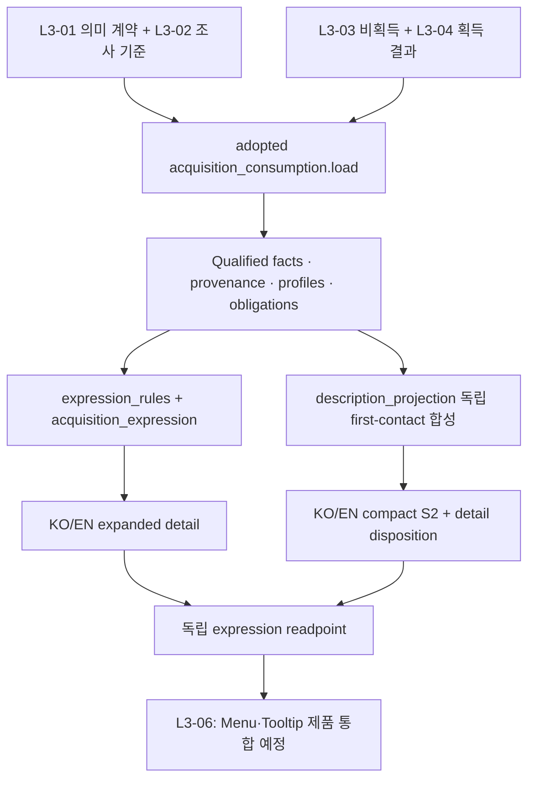

# Iris Layer 3 설명 생성 Walkthrough

작성일: 2026-09-05  
대상: 현재 세션의 DVF-L3-05 구현, 사용자 표시 해상도 교정, 채택 및 canonical 문서 갱신

이번 세션에서는 이미 채택된 Layer 3 사실을 KO/EN 상세 설명과 Tooltip-first S2로 변환하는 독립 설명 authority를 구현했다. 최종 상태는 **해상도 교정본 complete / adopted (off-live)**다. Menu와 Tooltip에 연결할 설명 데이터는 준비됐으며, 실제 제품 노출과 runtime 전환은 L3-06에 남아 있다.

이 문서는 구현을 읽는 순서와 결과의 의미를 설명한다. 요구사항은 [구현 계획](C:/Users/MW/Downloads/coding/PZ/docs/iris_dvf_layer3_fact_bound_expression_menu_tooltip_resolution_plan.md), 소비 규칙은 [expression contract](C:/Users/MW/Downloads/coding/PZ/docs/iris_layer3_expression_contract.md), 정확한 실행 이력과 검증 범위는 [closeout](C:/Users/MW/Downloads/coding/PZ/docs/iris_layer3_expression_closeout.md)을 따른다. Walkthrough는 새로운 validator나 채택 gate가 아니다.

## 1. 출발점과 완료 범위

L3-01은 복수 사실의 의미 계약을, L3-02는 프로필·조사 상태·first-contact obligation을 제공한다. L3-03의 비획득 사실과 L3-04의 획득 사실은 이미 별도 authority로 채택돼 있었다. L3-05의 책임은 이 근거와 조건을 유지하면서 사용자가 읽을 설명을 만드는 것이다.

| 입력 또는 결과 | 최종 상태 |
|---|---|
| Exact case-sensitive FullType | 2,105개 |
| Qualified accepted facts | 5,290개: 비획득 4,233개 + 획득 1,057개 |
| KO/EN fact-locale 표현 대응 | 10,580개 |
| Expanded의 represented fact set | locale별 accepted fact set과 일치 |
| Expanded의 획득 사실 | locale별 1,057개 모두 포함 |
| S2가 있는 item | locale별 1,280개 |
| S2가 없는 item | locale별 825개 |
| Accepted contributor 없는 first-contact obligation | 6,402개, upstream unresolved 보존 |
| Item investigation complete | 0개, 기존 조사 상태 유지 |

설명 생성 완료와 아이템 전체 조사 완료는 서로 다른 상태다. 이미 확인한 사실은 설명하되, 아직 확인하지 못한 기능이나 효과를 표현 단계에서 추측하지 않는다. 이는 [Philosophy.md](C:/Users/MW/Downloads/coding/PZ/docs/Philosophy.md)의 근거 기반 설명과 침묵 원칙을 따른다.

## 2. 입력에서 설명까지



S2는 expanded 문장을 잘라 만드는 결과가 아니다. 두 출력은 같은 accepted facts에 결속되며, 상세 설명과 첫 이해라는 서로 다른 목적에 맞춰 생성된다. 프로필은 어떤 사실들이 함께 설명될 수 있는지를 정하고, 대표 사실이나 중요도를 선택하지 않는다.

코드는 다음 순서로 읽으면 흐름을 따라가기 쉽다.

| 파일 | 역할과 주요 진입점 |
|---|---|
| [expression_results.py](C:/Users/MW/Downloads/coding/PZ/Iris/tooling/src/iris_tooling/domains/layer3/expression_results.py) | `read_inputs`로 adopted 입력을 읽고, `normalize`·`produce`로 사실과 설명을 구성한다. `prepare`·`load`·`adopt`가 생성·소비·채택을 소유한다. |
| [expression_rules.py](C:/Users/MW/Downloads/coding/PZ/Iris/tooling/src/iris_tooling/domains/layer3/expression_rules.py) | 프로필별 composition scope와 기능·효과·활동·역할·predicate의 KO/EN 표현을 정의한다. |
| [acquisition_expression.py](C:/Users/MW/Downloads/coding/PZ/Iris/tooling/src/iris_tooling/domains/layer3/acquisition_expression.py) | 획득 경로의 장소·방법·조건을 표현하고, 실제 설명의 근거가 된 dependency path를 연결한다. |
| [description_projection.py](C:/Users/MW/Downloads/coding/PZ/Iris/tooling/src/iris_tooling/domains/layer3/description_projection.py) | `compose`로 compact first-contact proposition을 독립 합성한다. |
| [test_layer3_expression_results.py](C:/Users/MW/Downloads/coding/PZ/Iris/build/description/v2/tests/test_layer3_expression_results.py) | 계획의 단일 focused acceptance source다. 입력 결속·표현·소비·채택 실패 처리·보호 경계를 같은 실행에서 확인한다. |

실행 주체는 설치된 `iris_tooling` 패키지다. Python 처리는 repository offline tooling에 한정되며, PZ에서 실행되는 Iris의 Lua 의존 구조를 바꾸지 않았다.

## 3. 상세 설명과 S2가 보존하는 것

Expanded에는 locale별 accepted fact 전체가 대응한다. 사실은 원래 payload와 provenance를 유지하며, 설명에는 claim과 그 조건이 함께 연결된다. 같은 아이템이 음식이면서 조리 재료이거나 도구이면서 수리 대상인 경우에도 모든 해당 역할을 보존한다. 특정 프로필에 속하지 않는 사실은 residual block으로 남긴다.

S2에는 first-contact obligation에 결속된 accepted 기능·효과·활동·역할을 구체적으로 합성한다. 일반 실행 전제를 문장마다 반복하지 않으면서, 실제 첫 이해를 바꾸는 조건은 남긴다.

| 구분 | 처리 |
|---|---|
| 오염수, 학습 범위, 호환 장치 등 의미를 바꾸는 조건 | 짧은 S2 문장에 실제로 표현 |
| 소지품·접근·권한·일반 행동 유효성 등 실행 상세 | expanded에 보존하고 S2의 `detail_qualifier_refs`로 추적 |
| S2 밖의 정상 상세 정보 | `tooltip_detail_omission_refs`로 추적 |
| Accepted contributor가 없는 질문 | upstream first-contact gap으로 보존 |

문장에서 생략한 qualifier를 S2에서 표현한 것으로 계산하지 않는다. 정상 상세 생략, upstream 미해결, accepted 사실의 표현 실패를 구별한다. 글자 수 cap, primary 선택, locale fallback과 runtime 재요약은 사용하지 않는다.

## 4. 실제 문장을 읽고 교정한 부분

최초 후보는 구조적인 사실 보존 검사를 통과했지만, 보고 세션에서 실제 S2와 획득 설명을 읽었을 때 일반 실행 전제와 내부 구현 정보가 과도하게 노출됐다. 같은 작업 안에서 표현 해상도를 교정했고, 최초 후보는 **superseded**로 남겼다.

S2에는 독립 합성을 도입했다. 예를 들어 음식의 섭취와 조리 역할, 음용과 갈증·오염수 효과, 도구의 여러 작업 맥락을 하나의 첫 이해 설명으로 묶었다. 다음은 교정된 실제 KO 출력이다.

| Item | S2 |
|---|---|
| Apple | 먹을 수 있으며, 음식 준비와 조리의 재료로 사용할 수 있다. |
| Hammer | 건축 작업·가구 이동·목공 작업에 도구로 쓰이며, 물품 수리의 대상이기도 하다. |
| WaterBottleFull | 마셔 갈증을 줄일 수 있으며, 오염된 물은 중독 수치를 높일 수 있다. |

Apple에는 accepted fact가 없는 허기 감소를 추가하지 않았다. Hammer의 수리 관련 accepted role은 `repair_target`이므로 수리 도구라고 바꾸지 않았다. WaterBottleFull은 음용 효과와 오염수의 조건부 효과를 함께 유지했다.

획득 설명은 장소·방법·의미 있는 이용 조건에 집중하도록 수정했다. 선택 가중치, raw random 수식, callback·등록·marker·destination·전달 처리의 내부 세부는 원래 payload/provenance에 보존한다. 이를 사용자 문장에 모두 열거하지 않으며 선택 가중치를 확률로 환산하지도 않는다. Worm의 채집·밭갈기·흙 퍼 담기 세 경로와 Generator의 기존 연결 해제된 월드 발전기 회수 및 상태·연료 보존은 유지했다.

최종 Gate에서 관찰한 비어 있지 않은 S2의 길이는 다음과 같다. nearest-rank 집계이며 합격 임계값이나 길이 제한이 아니다.

| Locale | p50 | p95 | max |
|---|---:|---:|---:|
| KO | 12자 | 39자 | 44자 |
| EN | 27자 | 83자 | 104자 |

나머지 825개 item은 accepted first-contact contributor가 없어 S2를 생성하지 않는다. 이 공백을 줄이려면 별도 upstream 의미 조사가 필요하다.

## 5. 최종 산출물과 채택

산출물은 기존의 짧은 root인 `Iris/_docs/authority/dvf/layer3_expression/`에 모았다.

| 파일 | 소비 의미 |
|---|---|
| [manifest.json](C:/Users/MW/Downloads/coding/PZ/Iris/_docs/authority/dvf/layer3_expression/manifest.json) | 네 입력과 data·review·producer·test·contract의 exact binding을 가진 readpoint |
| [descriptions.json](C:/Users/MW/Downloads/coding/PZ/Iris/_docs/authority/dvf/layer3_expression/descriptions.json) | 사실·근거·KO/EN 표현·expanded·S2·생략·upstream 상태 |
| [review.json](C:/Users/MW/Downloads/coding/PZ/Iris/_docs/authority/dvf/layer3_expression/review.json) | 표현 규칙과 locale별 검토 결속 |
| [adoption.json](C:/Users/MW/Downloads/coding/PZ/Iris/_docs/authority/dvf/layer3_expression/adoption.json) | 성공한 exact candidate의 채택 상태와 선행 superseded 이력 |

현재 manifest SHA-256은 `cff8acd83715e70c6e7b82553d47e538c7f75131437491d7cf6781875f5435be`다. 소비자는 `expression_results.load(repository_root, manifest_binding, mode="adopted")`를 사용한다.

Candidate bytes는 채택 시 바꾸지 않는다. Adoption 호출 안에서 adopted readback을 수행하고, 교정 채택에 실패하면 기존 superseded receipt를 복원한다. 새 manifest의 `supersedes`와 receipt의 `superseded_result`가 선행 결과를 연결하며, 별도 이력 디렉터리나 추가 manifest를 만들지 않았다. Current route·authority·validation registry에 이 off-live 결과를 등록하지 않았다.

## 6. 이미 수행한 검증

최초 후보의 단일 focused Gate는 `1 passed in 16.91s`, exit `0`이었다. 이 결과는 superseded된 최초 후보에만 속한다. 표현 교정에 맞춰 같은 source의 실제 문장 fixture, qualifier detail 처리, 획득 내부 정보 미노출 및 receipt 복원 검사를 보강한 뒤 최종 교정 후보에 한 번 다시 실행했다.

```powershell
$env:UV_CACHE_DIR = Join-Path (Get-Location) 'Iris/tooling/.tmp/uv-cache'
$env:PYTEST_DISABLE_PLUGIN_AUTOLOAD = '1'
uv run --project .\Iris\tooling --no-sync python -I -B -m pytest -q -s --noconftest --import-mode=importlib -c .\Iris\tooling\pyproject.toml --basetemp .\.tmp\expression .\Iris\build\description\v2\tests\test_layer3_expression_results.py
```

**교정 후보 결과: `1 passed in 14.17s`, exit `0`. Adoption/readback도 exit `0`.** 실행 중 약 10초 시점에 상태를 확인했고 다음 poll에서 정상 종료를 확인했다. 선행 PASS를 교정 후보에 승계하지 않았다.

Gate는 입력·member 결속, 전체 target/fact/locale 대응, first-contact contributor와 조건의 처리, 실제 문장 fixture, 결정성, 잘못된 소비 입력 거부, 채택 실패 복원 및 기존 보호 bytes를 함께 확인했다. Scratch는 `.tmp/expression`을 공유했다. 공용 conftest가 요구하는 외부 출력과 정규 registry 변경을 가져오지 않도록 `--noconftest`와 명시적 installed import/config/basetemp를 사용했다.

Installed package 준비와 candidate 생성은 acceptance 테스트가 아니다. 최초 offline 설치의 cache 부족과 교정 후보 생성 중 `OSError [Errno 22]` 실패 및 재시도는 기존 closeout에 구분해 기록돼 있다. 이 Walkthrough 작성과 직전 canonical 문서 갱신에서는 테스트를 추가 실행하지 않았다.

검증 범위는 off-live 설명 계약과 명시된 fixture까지다. 실제 PZ 실행, Menu rendering, Tooltip wrapping·Alt, S1/S3/S4 및 최종 4줄, package/release 검증이나 개별 문체의 전수 보증으로 확대하지 않는다.

## 7. 문서 갱신과 다음 작업

현재 세션에서는 구현 계획의 실행 기록, expression contract와 closeout을 작성·갱신하고, 다음 세 canonical 문서도 최종 교정본 기준으로 맞췄다.

- [DECISIONS.md](C:/Users/MW/Downloads/coding/PZ/docs/DECISIONS.md): L3-05 교정본의 off-live 채택, 선행 superseded 이력, 현재 검증 귀속과 제품 경계를 기록했다.
- [ARCHITECTURE.md](C:/Users/MW/Downloads/coding/PZ/docs/ARCHITECTURE.md): 설명 readpoint, 모듈별 표현 책임, 독립 S2 합성과 L3-06 통합 경계를 반영했다.
- [ROADMAP.md](C:/Users/MW/Downloads/coding/PZ/docs/ROADMAP.md): L3-05를 완료 상태로 맞추고 L3-06 제품 통합과 별도 upstream 조사 확대를 구분했다.

구현·교정 결과는 사용자가 지정한 보고 세션에도 전달했다. 기존 사용자 문서 삭제는 이번 구현의 변경으로 취급하거나 복구하지 않았다.

L3-06은 채택된 expanded와 compact S2를 Menu·Tooltip에 연결하고 S1/S3/S4·4줄·Alt·runtime/current adoption을 통합한다. 여기서 설명을 다시 번역·요약·절단하거나 대표 사실을 고르지 않는다. 빈 S2를 predecessor 문장이나 다른 계층 output으로 채우지 않으며, 미해결 upstream 질문의 전수 재조사를 제품 연결의 새 선행 gate로 만들지 않는다.
