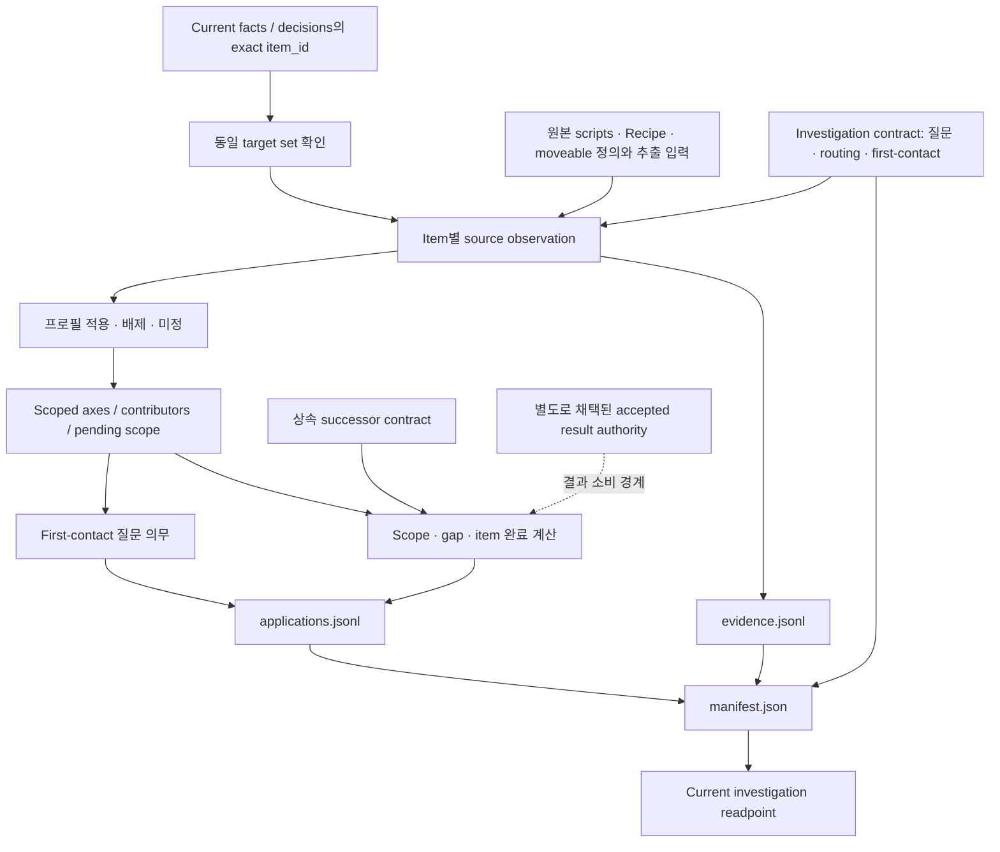

# Iris Layer 3 조사 기준과 application Walkthrough

> 작성일: 2026-09-04  
> 대상: 이번 세션에서 완료한 DVF-L3-02 구현과 후속 canonical 문서 정리  
> 상태: 조사 기준·전체 target 적용·investigation authority 채택 완료  
> 이 문서는 구현을 설명하는 안내다. 새로운 계약·검증 gate·fact authority를 추가하지 않는다.

## 1. 이번 작업으로 무엇이 가능해졌는가

Iris가 아이템을 설명하기 전에 **무엇을 조사해야 하고, 무엇이 아직 확인되지 않았는지**를 전체 대상에 대해 계산할 수 있게 됐다.

기존 Layer 3 successor contract는 아이템 하나에 복수 의미가 공존하고, 역할은 활동 맥락에 속하며, 사실·조사·표현·표시 상태를 구분해야 한다는 원칙을 확립했다. 이번 작업은 그 원칙을 실제 조사에 사용할 수 있는 프로필·질문·완료 조건과 application으로 구체화했다.

결과는 세 가지다.

1. 조사자는 아이템마다 적용되는 질문, 근거로 배제된 범위, 아직 결정하지 못한 범위를 확인할 수 있다.
2. 설명 구성자는 first-contact에서 답해야 할 질문과 상세 정보로 남길 경계를 확인할 수 있다.
3. 후속 fact 조사자는 exact item별 부족 근거와 다음 판단을 따라갈 수 있다.

**전체 2,105개 target에 application을 작성했다.** 다만 실제 accepted semantic/acquisition results는 이번 범위에서 공급하지 않았으므로 **item complete는 0개**다. 조사 체계와 전체 적용의 완료를 아이템 사실 조사 완료와 구별해야 한다.

관련 기준은 [구현 계획](iris_dvf_layer3_multi_profile_investigation_completion_first_contact_plan.md), [human contract](iris_dvf_layer3_multi_profile_investigation_completion_first_contact_contract.md), [실행 closeout](iris_dvf_layer3_multi_profile_investigation_completion_first_contact_closeout.md)에 있다.

## 2. 전체 흐름



점선의 accepted result authority는 후속 결과를 소비하는 경계다. 현재 전체 application writer는 해당 결과를 공급하지 않으며, 원본 관찰에서 accepted facts를 자동 생성하지 않는다. 이 흐름에서 composer·publisher·게임 runtime으로 이어지는 호출은 없다.

## 3. 코드와 산출물의 책임

주요 구현은 [investigation.py](../Iris/tooling/src/iris_tooling/domains/layer3/investigation.py)에 모았다. 기존 [Layer 3 CLI](../Iris/tooling/src/iris_tooling/domains/layer3/cli.py)는 `investigate` 분기만 추가했다.

| 함수 | 입력과 책임 | 결과 또는 실패 경계 |
|---|---|---|
| `targets()` / `exact_rows()` | Current facts/decisions의 `item_id`를 읽는다. | 중복·missing·extra 없는 exact target set. 대소문자나 공백을 정규화하지 않는다. |
| `inherited_contract()` / `acquisition_rules()` | 상속 manifest/member의 bound bytes와 획득 계약을 읽는다. | 허용 kind·negative binding·resolved 조건. 누락이나 지원하지 않는 값은 오류다. |
| `validate_contract()` | 프로필·axis·routing·first-contact 참조를 확인한다. | 중복 ID, 알 수 없는 axis/predicate, 빈 필수 설명 등을 거부한다. |
| `source_observations()` | Contract에 결속된 원본과 추출 입력에 predicate를 적용한다. | Item별 원본 locator/field, Recipe 관찰·미검증 후보, moveable 관찰과 gap. |
| `routes_for()` / `merge_routes()` | 관찰을 프로필 적용 상태로 바꾸고 같은 프로필의 근거를 모은다. | 적용·배제·미정 및 충돌 보존. 순위로 승자를 고르지 않는다. |
| `resolve_item()` | 프로필별 질문과 scope를 합치고 결과 상태를 해석한다. | Required axes, contributor, pending, first-contact, blocker와 계산된 완료 상태. |
| `load_result_authorities()` / `terminal_result()` | 명시적으로 제공된 별도 adopted result authority와 결과를 소비한다. | Subject·fact·provenance·질문 범위에 결속되지 않은 terminal claim을 거부한다. |
| `applications()` / `apply()` | 전체 target을 적용하고 고정 investigation 출력 경로에 쓴다. | Evidence/application 한 벌과 이를 결속한 manifest. |

채택 root는 `Iris/_docs/authority/dvf/layer3_investigation/`다.

| 파일 | 읽을 때 확인할 내용 |
|---|---|
| [contract.json](../Iris/_docs/authority/dvf/layer3_investigation/contract.json) | Revision, 프로필·질문, source binding, routing/완료/first-contact 규칙 |
| [evidence.jsonl](../Iris/_docs/authority/dvf/layer3_investigation/evidence.jsonl) | Exact item별 원본 관찰과 locator, 적용 근거와 미검증 source 범위 |
| [applications.jsonl](../Iris/_docs/authority/dvf/layer3_investigation/applications.jsonl) | Item별 적용 상태, required axes, pending scope, first-contact와 blocker |
| [manifest.json](../Iris/_docs/authority/dvf/layer3_investigation/manifest.json) | 상속/target identity 및 위 세 파일과 human contract의 path/hash 결속 |

Manifest 자체를 제외한 세 machine file과 human contract가 네 member다. 별도 target universe, reconciliation, profile별 파일이나 검증 gate별 디렉터리는 만들지 않았다.

## 4. 프로필은 아이템 분류가 아니라 조사 질문이다

한 아이템에 여러 프로필을 적용할 수 있다. 프로필을 적용했다는 것은 그 질문을 조사해야 한다는 뜻이며, 이미 그 기능이나 효과가 accepted fact로 확정됐다는 뜻은 아니다.

Revision 1의 프로필은 다음과 같다.

| 프로필 | 조사하는 질문 | 현재 적용을 여는 근거 |
|---|---|---|
| `direct` | 다른 질문으로 포착하지 못한 직접 기능과 상태 변화가 있는가? | 모든 target에 남기는 residual 질문 |
| `ingestion` | 실제 섭취 가능성·효과·조건은 무엇인가? | 원본과 추출의 native `Type=Food` 일치 |
| `combat` | 공격에 쓰는 방식과 성립 조건은 무엇인가? | Native `Type=Weapon` 일치 |
| `wearing` | 착용 기능과 상태·제약은 무엇인가? | Native `Type=Clothing` 일치 |
| `storage` | 수납·운반 기능과 제한은 무엇인가? | Native `Type=Container` 일치 |
| `reading` | 읽기·기록·학습 중 실제 어떤 기능과 효과가 있는가? | Native `Type=Literature` 일치 |
| `expenditure` | 어떤 기능이 사용량을 소모하며 소진 시 무엇이 달라지는가? | Native `Type=Drainable` 일치 |
| `crafting` | 제작·변환 활동에서 어떤 역할을 하는가? | 원본 static Recipe의 exact input/keep 직접 token 확인 |
| `cooking` | 조리 활동에서 어떤 역할과 조건을 갖는가? | 원본의 nonempty `EvolvedRecipe` field |
| `world_work` | 월드 물체 작업에서 어떤 도구 역할과 조건을 갖는가? | 원본 `addToolDefinition`의 exact item 또는 alias/tag 일치 |

Native Type이 다르다는 근거는 해당 원본 declaration의 **그 native channel만** 배제한다. Lua에서 비슷한 효과를 내는 행동이나 다른 활동 가능성까지 배제하지 않는다. 그런 범위는 `direct`와 gap 질문에 남는다.

원본 Type을 확정할 수 없거나 추출과 일치하지 않으면 배제하지 않는다. Recipe index에서 관계가 없다는 이유만으로 crafting을 배제하지도 않는다. Group 확장·동적 동작·다른 source 경로가 남을 수 있기 때문이다.

## 5. 적용 상태와 조사 완료를 읽는 방법

Applicability에는 네 상태가 있다.

| 상태 | 의미 |
|---|---|
| `confirmed_applicable` | 해당 질문을 적용할 원본 근거가 있다. |
| `evidence_backed_not_applicable` | 명시된 source 범위 안에서 그 질문 범위를 배제할 근거가 있다. |
| `investigated_unresolved` | 적용 여부를 살폈지만 확정할 근거가 부족하거나 충돌한다. |
| `not_investigated` | 적용 여부를 아직 조사하지 않았다. |

Positive/negative 근거가 충돌하면 양쪽 관찰을 보존하고 미정으로 남긴다. Positive로 관찰한 context도 삭제하지 않는다. 누락된 record를 자동 N/A로 읽지 않는다.

조사 axis는 `acquisition`, `operation`, `effects`, `role`, `conditions` 다섯 종류다. 실제 key는 다음 세 값의 조합이다.

```text
(item_id, axis_id, scope_ref)
```

같은 key에 여러 프로필이 기여하면 contributor를 합친다. Axis 이름이 같아도 context가 다르면 별도 질문으로 유지한다. `scope_ref`는 조사 범위를 식별하며 semantic `use_context` fact를 생성하지 않는다.

Global acquisition은 item scope에서 정확히 한 번만 요구한다. 나머지 required axes는 적용 프로필들의 scoped union이다. 아직 적용을 결정하지 못한 프로필은 `pending_scope_refs`에 질문·근거·다음 조사를 남긴다.

완료 조건은 다음과 같다.

```text
item_complete
  = scope_determined
    AND every_required_axis_terminal_under_its_contract
    AND acquisition_state == resolved
```

`scope_state`, `coverage_gap_state`, `item_investigation_state`는 별도 값이다. 프로필 적용 여부가 모두 설명돼도 gap assessment가 미정이면 scope는 닫히지 않는다. 획득 하나를 해결해도 다른 필수 질문이 열려 있으면 item은 incomplete다.

일반 axis는 계약에 따라 근거 있는 N/A를 허용하지만 acquisition은 허용하지 않는다. Fact 하나나 풍부한 prose가 있다는 이유로 질문 전체를 완료하지 않으며 최소 fact·용도·문장 수를 요구하지도 않는다.

## 6. First-contact는 문장이 아닌 의미 요구다

프로필의 `first_contact`에는 다음이 함께 있다.

- `user_question`: 사용자가 처음 이해해야 하는 질문.
- `first_understanding_reason`: 그 정보가 첫 이해에 필요한 이유.
- `detail_boundary`: 상세 정보로 남길 부분과 생략하면 안 되는 의미 경계.
- `required_question_ref`: 해당 조사 질문과의 연결.

예를 들어 `Base.Apple`에는 ingestion의 효과 질문과 cooking의 역할 질문이 따로 적용된다. 먹었을 때의 변화가 조리 활용을 설명해 주지는 않는다. 정확한 영양 수치와 개별 EvolvedRecipe 관계는 상세로 남기되, 확인된 기능의 진실 범위를 바꾸는 조건은 첫 이해에서도 유지해야 한다.

`Base.Dogfood`는 원본 `CantEat=TRUE` 때문에 현재 형태의 섭취 가능성부터 조사해야 한다. `Type=Food`만 보고 먹을 수 있다거나 허기를 해소한다고 문장을 만들지 않는다. `Base.Notebook`도 Literature라는 이유만으로 학습 효과를 부여하지 않는다.

Accepted facts가 아직 없어도 first-contact obligation은 application에 남으며 표현 상태는 deferred다. Global acquisition을 모든 item의 첫 접촉 문장으로 복사하거나, axis마다 한 문장·한 줄을 배정하지 않는다. 실제 fact binding·KO/EN·S2 문장/줄·omission tracking은 L3-05의 범위다.

## 7. 실제 application을 따라 읽는 예

`Base.Hammer`를 조사한다면 다음 순서로 읽을 수 있다.

1. `evidence.jsonl`에서 exact `item_id=Base.Hammer` record를 찾는다.
2. 원본 item의 Type/Tags와 moveable 정의의 token·alias/tag 연결을 확인한다.
3. `applications.jsonl`의 같은 item에서 `combat`, `world_work`, `direct` 적용을 확인한다.
4. 서로 다른 scope의 required axes와 first-contact 요구가 함께 남아 있는지 읽는다.
5. Crafting의 적용 미정과 원본 direct token으로 확인하지 않은 Recipe group 후보를 구별한다.
6. `blockers`의 질문·`missing`·`next`를 실제 의미 조사 입력으로 사용한다.

이 기록은 망치의 대표 역할을 정하지 않는다. 무기 사용과 월드 작업의 질문을 모두 보존하며, 확인되지 않은 Recipe group의 의미를 자동으로 채택하지도 않는다.

`Base.Plank`의 원본 Recipe에는 input과 keep 관찰이 모두 있다. 여기서도 하나의 item-global 역할로 압축하지 않는다. `Base.Battery`에는 expenditure와 crafting, direct 질문이 함께 적용되지만 실제 기능과 획득 결과는 별도 조사가 필요하다.

## 8. 전체 적용 결과와 구체적인 잔여

Current facts/decisions에서 도출한 exact target은 2,105개이며 중복·missing·extra 없이 일치했다. Registry revision 1은 32개 source 파일의 bytes를 결속했다. 이 결속은 source identity의 확인이며, 정확한 upstream build나 source 전수 의미 완전성의 보증은 아니다.

| 프로필 | 적용 확인 | 근거 있는 native 배제 | 적용 미정 |
|---|---:|---:|---:|
| direct | 2,105 | 0 | 0 |
| ingestion | 476 | 1,625 | 4 |
| combat | 161 | 1,940 | 4 |
| wearing | 548 | 1,553 | 4 |
| storage | 69 | 2,032 | 4 |
| reading | 106 | 1,995 | 4 |
| expenditure | 113 | 1,988 | 4 |
| crafting | 326 | 0 | 1,779 |
| cooking | 226 | 0 | 1,879 |
| world_work | 20 | 0 | 2,085 |

동일 item이 여러 프로필에 포함되므로 행들을 합쳐 target 수로 해석하면 안 된다. 프로필 수나 미정 비율은 합격 quota가 아니다.

Native 적용을 확정하지 못한 네 대상은 원인이 구체적이다.

| 대상 | 남아 있는 문제 |
|---|---|
| `Base.Bag_PistolCase` | 추출된 Container에 대응하는 단일 원본 declaration 부재 |
| `Base.Lemongrass` | 추출된 Food에 대응하는 원본 declaration 부재 |
| `Base.NoiseMaker` | 추출된 Weapon에 대응하는 원본 declaration 부재 |
| `Base.ShotgunCase1` | `scripts/newBags.txt` L106/L239의 중복 declaration; 두 locator 보존 |

그 밖에 Recipe group·동적 조리·월드 작업/수선 경로의 미확정 범위가 있다. 각 application의 pending/blocker는 exact item에 귀속된다. 일반적인 `자료 부족` 대신 영향 질문, 부족 근거와 다음 판단을 기록한다.

현재 모든 target의 accepted semantic/acquisition results는 미공급 상태다. 따라서 item complete 0개가 정직한 결과다. 후속 조사에서 기존 질문으로 설명되지 않는 의미가 발견되면 `definition_gap` 또는 `question_scope_extension`을 명시하고 revision과 영향 범위를 재평가해야 한다.

## 9. 획득 결과를 확정하는 경계

Resolver는 상속 successor JSON의 세 계약을 실제로 읽는다.

```text
/semantic_node/allowed_fact_kinds
/semantic_node/bindings/acquisition_unobtainable
/acquisition/resolved_requires
```

허용 kind가 선언돼 있다는 사실과 accepted instance가 있다는 사실은 다르다. 기존 `acquisition_unobtainable`의 current producer `none`, assignment `0`은 변경하지 않았다.

후속 결과를 resolved로 소비하려면 별도 adopted result authority, path/hash와 source binding, exact FullType/fact ID/provenance, accepted result membership, 질문 전체의 scope coverage가 필요하다. Negative acquisition에는 닫힌 source 범위·completeness·false-negative 제한과 subject 결속도 필요하다.

요건이 부족한 terminal claim은 오류로 거부한다. Resolver가 부족한 근거를 자체 보충하거나 authority를 비준하지 않는다. G1에 사용한 미래 negative fixture는 합성 소비 사례이며 실제 획득 불가 fact를 채택한 기록이 아니다.

## 10. 실행·검증과 current 연결

구현 중 사용한 application 작성 명령은 다음과 같다. 이 명령은 읽기 전용 조회가 아니라 investigation 산출물을 작성한다.

```powershell
uv run --project .\Iris\tooling --no-sync python -m iris_tooling --repository-root . build layer3 investigate
```

필수 검증은 [test_layer3_investigation_contract.py](../Iris/build/description/v2/tests/test_layer3_investigation_contract.py)의 단일 identity다.

```text
test_layer3_investigation_contract.Layer3InvestigationContractTest.test_investigation_contract
```

G1은 target/schema/source/상속 결속, routing·context/contributor·완료·first-contact·획득 소비 경계 사례, 전체 application 한 번 재계산, current 연결과 보호 상태, 기존 CLI dispatch를 묶어 확인했다. 전체 target의 별도 A/B 출력이나 gate별 evidence tree를 만들지 않았다.

첫 G1은 기존 authority entry 중 `path`가 없는 형식을 test가 잘못 가정해 실패했다. 해당 접근을 `e.get("path")`로 교정한 뒤 같은 G1만 재실행했다. 최종 결과는 **exit `0`, `1 passed, 24 subtests passed in 1.35s`**다. 실행은 수 초 안에 정상 종료했고 장기 실행이나 강제 중단은 없었다.

Adoption 실행은 시작 시 캡처한 28개 명시적 보호 파일 및 기존 config 보존 부분의 임시 baseline을 사용했다. 두 환경 변수는 실행 후 복원했고 helper/baseline은 제거했다. 임시 baseline을 과거 상태로 재생성해 같은 채택을 다시 증명할 수 있다는 뜻은 아니다. 정확한 당시 명령과 결과는 [closeout](iris_dvf_layer3_multi_profile_investigation_completion_first_contact_closeout.md)에 남아 있다.

Current authority manifest와 route index에는 `layer3_investigation_contract` 연결 한 건을 추가했다. Required registry에는 test identity 한 건, 기존 source policy에는 승인된 source 등록과 tracked denominator 50→51을 반영했다. Guard는 그대로 유지했다. `.gitattributes`에는 신규 bundle/human contract의 byte 보존 규칙만 추가했다.

Manifest의 `status=adoption_subject`는 고정된 검증 subject의 표시다. Current route의 `state=adopted`와 실제 G1 성공 기록이 채택 결과를 설명한다. 파일의 status 문자열만으로 검증 성공을 자체 발급하지 않는다.

## 11. 세션 종료 상태와 다음 작업

구현 closeout 뒤 사용자의 추가 요청으로 세 canonical 문서의 완료 표현을 정리했다.

| 문서 | 반영한 내용 |
|---|---|
| [DECISIONS.md](DECISIONS.md) | L3-02 current investigation authority 채택과 G1 성공 확정. 결정을 Iris Layer 3 절에 배치하고 의미·표현·제품 전환의 책임 경계를 명시. |
| [ROADMAP.md](ROADMAP.md) | L3-02를 Done에 추가. Next를 L3-03~06 및 exact target별 후속 조사로 정리. |
| [ARCHITECTURE.md](ARCHITECTURE.md) | Resolver·CLI·contract/evidence/application/manifest의 책임, 완료 계산과 현재 제품의 분리를 설명. |

이 문서 정리와 Walkthrough 작성에서는 테스트를 추가 실행하지 않았다. 기존 G1 결과는 당시 implementation/adoption subject의 검증 기록이며 후속 문서 편집을 새 검증 성공으로 표현하지 않는다. 새 proof artifact나 validation authority도 만들지 않았다.

기존 successor bundle, current facts/decisions, composer, generation/pointer, renderer/assembler와 기존 product locator를 보존했다. Runtime·KO/EN·Menu/Tooltip·package의 제품 변경은 수행하지 않았다. Commit도 만들지 않았다.

후속 책임은 다음과 같다.

1. **L3-03:** Application의 의미 질문과 pending/gap을 따라 실제 semantic facts를 조사하고 채택한다.
2. **L3-04:** 별도 획득 source와 accepted acquisition results를 구축한다. 획득 해결만으로 item 전체를 완료하지 않는다.
3. **L3-05:** 같은 accepted facts와 first-contact 기준을 이용해 Menu 상세와 Tooltip S2의 실제 fact binding·KO/EN·문장/줄·omission을 구성한다.
4. **L3-06:** Runtime/current product 전환을 구현하고 그 범위에 필요한 검증을 수행한다.

이번 계획에 남은 필수 작업은 없다. 남아 있는 것은 후속 fact 조사와 표현·제품 전환이며, 실제 semantic/acquisition 전수 정확성·모든 item complete·실게임 이해도·package/compatibility·release readiness는 이번 완료 주장에 포함되지 않는다.
