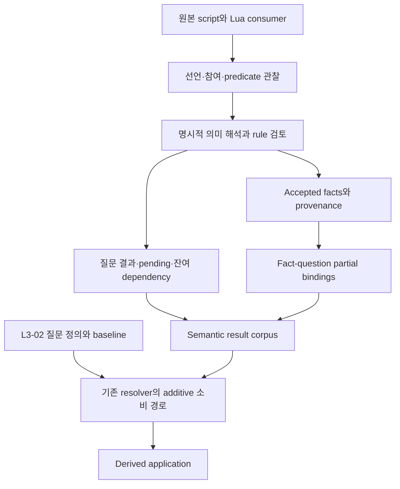

# Iris 비획득 의미 결과 Walkthrough

작성일: 2026-09-04  
대상: 현재 세션에서 구현·검증·채택한 DVF-L3-03과 관련 문서 정리

이번 작업은 아이템의 비획득 의미를 원본 근거와 함께 구조화하고, 그 사실이 어떤 조사 질문에 기여하는지 연결하는 offline 경로를 구현했다. 최종 결과는 별도 authority로 채택했다. Acquisition, 아이템 전체 조사 완료, KO/EN 표현, Menu/Tooltip 및 runtime/product 전환은 이번 완료 범위에 포함하지 않는다.

이 문서는 구현을 따라 읽기 위한 설명이다. 채택 계약과 정확한 실행·실패 이력은 [구현 계약](/C:/Users/MW/Downloads/coding/PZ/docs/iris_dvf_layer3_semantic_investigation_question_results_contract.md)과 [단일 closeout](/C:/Users/MW/Downloads/coding/PZ/docs/iris_dvf_layer3_semantic_investigation_question_results_closeout.md)을 따른다. 새로운 validation authority나 추가 gate를 정의하지 않는다.

## 1. 출발점과 해결한 문제

L3-01은 복수 의미·context-local role·fact-local 조건을 표현하는 의미 계약을 제공한다. L3-02는 exact FullType 2,105개에 대해 조사 profile, required axis, pending scope, first-contact 및 item 완료 기준을 적용한 baseline이다. L3-02 baseline 자체에는 accepted semantic/acquisition 결과가 없었다.

이번 작업에서는 그 baseline을 덮어쓰지 않고 별도 결과를 공급했다. 핵심은 **사실을 일부 확인한 상태와 질문 전체를 해결한 상태를 분리하는 것**이다. 원본이 어떤 기능을 뒷받침하더라도 해당 질문의 다른 동작·조건·엔진 경계가 남아 있다면, 확인한 사실은 보존하면서 질문은 unresolved로 유지한다.

실행 기준은 사용자 지정 질의 작업 `01a0620a-a4a0-75a0-ba48-d7199bb9485a`의 답변을 반영한 A1·B1·C2다.

| 기준 | 이번 구현에서의 의미 |
|---|---|
| A1 | 결속된 available-source 질문·route, pending 및 새 key의 단순 미조사 0. 실제 조사 후 부족한 source/engine/runtime dependency는 unresolved로 보존 |
| B1 | Unique automatic rule의 전제·변환·예외를 전수 의미 검토하고 층화 표본을 감사. 모든 item의 수작업 의미 정확성 보증으로 확대하지 않음 |
| C2 | L3-02 definition revision 1과 baseline writer/application을 보존하고 별도 semantic result authority를 채택 |

## 2. 원본에서 application까지



| 구성요소 | 읽을 때 확인할 역할 |
|---|---|
| [source_reader.py](/C:/Users/MW/Downloads/coding/PZ/Iris/tooling/src/iris_tooling/domains/layer3/source_reader.py) | 문자열·주석·반복 선언과 clause를 보존하는 reader. Raw recipe 참여, group 및 selected-item predicate를 관찰 |
| [interpretations.py](/C:/Users/MW/Downloads/coding/PZ/Iris/tooling/src/iris_tooling/domains/layer3/interpretations.py) | 검토한 callback 집합과 inventory caller→action의 의미·조건·엔진 경계를 명시 |
| [semantic_results.py](/C:/Users/MW/Downloads/coding/PZ/Iris/tooling/src/iris_tooling/domains/layer3/semantic_results.py) | 원본 결속, A~E 조사, fact admission, 질문 결과·pending·universe·partial binding 생산과 manifest 소비 |
| [semantic_model.py](/C:/Users/MW/Downloads/coding/PZ/Iris/tooling/src/iris_tooling/domains/layer3/semantic_model.py) | 의미 기반 ID, 전체 typed payload와 관계 무결성, structured application 소비 |
| [investigation.py](/C:/Users/MW/Downloads/coding/PZ/Iris/tooling/src/iris_tooling/domains/layer3/investigation.py) | 기존 질문 정의와 contributor union을 유지하며 별도 결과·partial binding을 resolver에 수용 |
| [cli.py](/C:/Users/MW/Downloads/coding/PZ/Iris/tooling/src/iris_tooling/domains/layer3/cli.py) | `semantic-results` 명령을 새 producer로 전달하고 기존 `investigate` 및 composer 진입점 유지 |

명령 분기는 `build layer3 semantic-results --output <candidate directory>`다. Producer는 저장소 내부의 허용된 candidate 경로를 사용하고 기존 출력 덮어쓰기를 거부한다. 이 walkthrough 작성 중 생산 명령을 다시 실행하지 않았다.

## 3. 조사 경로에서 달라진 점

| Route | 조사 내용 | 해석의 경계 |
|---|---|---|
| A — native | Item 선언·중복 property와 실제 소비 동작의 연결 | Type과 field 존재만으로 기능·효과를 확정하지 않음 |
| B — static recipe | Raw input/keep/destroy/result, group 확장, raw↔index 역대조, callback 소비 | Index는 seed. `keep`을 일괄 tool로, recipe result를 결과 item의 용도로 변환하지 않음 |
| C — dynamic cooking | EvolvedRecipe ingredient/base/result와 cooked/frozen 조건, `getItemsCanBeUse`·`addItem` 경계 | Runtime eligibility와 엔진 내부 계산은 별도 dependency |
| D — world work | Fixing Require/Fixer, moveable tool, multistage 및 활성 construction branch | 수선·이동·건설의 역할을 분리하고 대상·재료·도구·world 조건 보존 |
| E — residual direct | Recipe와 독립된 inventory predicate/action, replacement chain, 추가 callback handoff | 문자열 hit·부분 atom 평가·함수 발견을 전체 의미 조사로 간주하지 않음 |

특히 `CALLBACK_READINGS`의 명시적 검토 집합과 원본에서 발견한 함수 집합을 분리했다. 함수 본문이 존재해도 의미 검토 집합에 없으면 `defined_but_unreviewed_callbacks`와 `not_investigated`로 남는다. Inventory action도 명시적 해석이 없으면 미조사다. 이 구분은 수집기 미구현이나 단순 열람을 unresolved로 바꿔 A1을 통과시키는 것을 막는다.

Raw/index 누락과 중복은 원본을 보존한 상태로 기록한다. Recipe group은 검토한 tag/type union 및 fabric/type/name predicate만 확장하며, runtime registry와 loader winner를 추정하지 않는다. 일반 equip/drop, debug editor 및 tooltip 생성은 실제 caller를 확인하고 intrinsic function 근거에서 제외했다.

## 4. 구체적인 의미 표현 사례

아래 설명은 확인한 proposition과 조건을 풀어쓴 것이다. 별도의 KO/EN 제품 문장을 작성하거나 배포한 것은 아니다.

| 대상 | 보존한 의미 | 함께 남긴 조건·한계 |
|---|---|---|
| `Base.BucketWaterFull` | 저장된 물 음용, 갈증 감소, 조건부 poison 증가 | 수동 음용 메뉴의 갈증 `> 0.1`, 소비 시 양의 갈증·inventory·남은 분량. Tainted water의 poison 증가는 poison `< 20`, sickness `< 0.3` 조건에 한정 |
| `Base.BookTrapping1` | 독서와 조건부 Trapping XP multiplier 증가 | 읽기 진척·지원 훈련 level·현재 multiplier 비교 및 reading validity. 즉시 XP 획득으로 표현하지 않음 |
| `Base.Bag_Schoolbag` | Item 보관·회수 | 공간, item admission, removal, 접근 가능한 서로 다른 container 및 multiplayer 제한 |
| `Base.Hammer` | Woodworking tool, construction tool, furniture-moving tool, repair target | 각 context의 역할을 별도 참조. Repair target을 repair material과 합치지 않고 log-wall의 no-hammer branch도 유지 |
| `Base.Shirt_Denim` | 착용과 fabric recovery material | 착용으로 보호·보온 효과를 자동 확정하지 않음. 해체는 활성 recipe와 fabric 조건에 근거하며 예전 비활성 우클릭 handler를 근거로 삼지 않음 |
| `Base.Battery` | 호환 portable device의 power supply | 실제 `destroy Battery` recipe와 charge-transfer callback에 근거. 일반 Drainable 분류를 전원·연료로 승격하지 않음 |
| `Base.Dogfood` / `Base.DogfoodOpen` | 닫힌 형태의 native eating 배제와 열린 형태의 섭취 기능을 구별 | `CantEat` negative는 현재 형태의 native eating 채널에 한정. 개봉·가공·item 전체 용도 부재를 뜻하지 않음 |

추가로 note 기록, body drying, bandaging, hair dye, pills 복용, food-preparation ingredient, repair 및 construction을 source 조건에 한정해 admission했다. 약 복용이나 bandaging 동작이 확인되어도 엔진 내부의 약효·치유량을 임의로 채우지 않았다.

## 5. Fact와 question을 연결하는 방식

지원하는 non-acquisition kind는 `use_context`, `context_role`, `direct_function`, `effect`, `state`, `condition`, `constraint`다. Kind 지원과 해당 kind의 실제 fact 생산 수는 별개다.

`context_role`은 같은 item의 `use_context`를 참조한다. `condition`과 `constraint`는 `applies_to_fact_refs`로 적용 대상을 지정한다. 따라서 Hammer의 여러 역할이나 tainted-water의 특정 효과 조건이 item 전체의 대표 의미·전역 조건으로 합쳐지지 않는다.

`fact_id`는 semantic payload와 context/dependency를 포함한 canonical content에서 계산한다. Source locator, review timestamp, authority/registry metadata와 단순 serialization 순서는 의미 ID에 포함하지 않는다. 의미 정정은 새 ID를 만들고 해당 fact와 연결된 context·qualifier·question binding을 재결속해야 한다.

Question identity는 `(item_id, axis_id, scope_ref)`다. Revision은 별도 metadata이며 네 번째 key component가 아니다. 이번에는 기존 정의 안에서 source 참여가 확인된 scope instance를 추가했고, original key를 삭제하거나 정의 revision을 올려 분모를 바꾸지 않았다.

Open question의 terminal `fact_refs`는 비워 둔다. 확인한 사실은 `fact_question_bindings`의 partial contribution으로 연결한다. 하나의 fact가 여러 질문에 기여할 수 있으며 질문 수만큼 fact를 복제하지 않는다. Whole-scope 근거가 없는 partial 사실로 `resolved`를 만들지 않는다.

## 6. 결과를 읽는 방법

| 항목 | 최종 결과 |
|---|---:|
| Exact target | 2,105 |
| Source bindings | 216 |
| Accepted facts | 4,233 |
| 기존 non-acquisition 질문 | 8,882 |
| 새로 추가한 질문 | 1,100 |
| 전체 non-acquisition 질문 | 9,982 |
| `investigated_unresolved` | 9,900 |
| `evidence_backed_not_applicable` | 82 |
| Partial facts가 기여하는 질문 | 3,498 |
| 기존 pending item/profile pair | 5,767 |
| Pending에서 `applicable`로 처분 | 550 |
| `pending_with_blocker`로 보존 | 5,217 |
| Acquisition `not_investigated` | 2,105 |
| Item complete | 0 / 2,105 |

질문 수, fact 수, pending pair 수는 서로 다른 단위다. 여러 profile에 걸친 동일 item을 중복 합산해 item 완료율을 계산하지 않는다. L3-03의 완료는 source-bound 비획득 결과 구축·검증·채택의 완료이며, 위 unresolved를 모두 해결했다는 뜻이 아니다.

네 anomaly도 개별 결과로 보존했다. `Base.Bag_PistolCase`, `Base.Lemongrass`, `Base.NoiseMaker`는 exact raw declaration이 없어 near-name 검색만으로 alias를 확정하지 않았다. `Base.ShotgunCase1`은 두 선언을 모두 보존하고 loader winner가 없어 unresolved로 남겼다. 관련 native pending과 direct/gap 질문은 유지한다.

## 7. 채택과 최종 검증

최종 [semantic result manifest](/C:/Users/MW/Downloads/coding/PZ/Iris/_docs/authority/dvf/layer3_semantic_results/manifest.json)의 SHA-256은 다음과 같다.

```text
a3416672aa47fe4c6c84d9b8e9912377adda6e20e9eb679bf2d229cb9d3456bd
```

Manifest는 corpus, definition readpoint, producer, human contract와 G1 source를 결속한다. Corpus의 `candidate` lifecycle bytes는 검증 이후 유지한다. Current route의 `adopted`와 동일 subject의 성공 closeout이 함께 있을 때 adopted loader가 논리 envelope를 제공한다. 별도의 대용량 application 파일은 만들지 않고 corpus에 보존한 structured 입력을 resolver로 계산한다.

계획의 최종 G1 명령은 다음과 같았다. 아래는 실행 이력이며 이 문서 작성을 위한 재실행 명령이 아니다.

```powershell
uv run --project .\Iris\tooling --no-sync python -m pytest .\Iris\build\description\v2\tests\test_layer3_semantic_results.py -q -p no:cacheprovider --round3-contract=diagnostic --round3-additional-source=Iris/build/description/v2/tests/test_layer3_semantic_results.py
```

Adoption mode와 repository-local baseline/manifest를 명시했으며 환경 변수의 정확한 값은 closeout에 기록하고 실행 뒤 복원했다. 첫 G1은 테스트의 recipe 순회 변수가 manifest 참조를 덮어써 첫 item에서 실패했다. 변수명을 수정하고 같은 corpus의 테스트 member·manifest 결속을 갱신한 뒤 같은 G1만 재실행했다.

**최종 결과: exit `0`, `1 passed, 19 subtests passed in 3.40s`.** 정상 완료한 전체 corpus 소비는 이 실행 한 번이다. 성공 후 추가 confidence 테스트는 하지 않았다.

G1은 전체 structured facts/provenance/results/bindings, target/key/pending, A1 accounting, B1 기록 결속, source/member/readpoint와 명시적 보호 경계를 함께 검사했다. 작은 독립 사례는 case identity, 의미 정정과 재결속, context/qualifier, scoped negative, partial과 open question의 공존, callback 발견과 의미 검토의 구분, CLI/fallback 및 결정성을 다뤘다. 검증 범위는 명시적 보호 파일 33개와 기존 config/product locator에 한정하며 전체 runtime/package parity를 주장하지 않는다.

생산 준비 중에는 apostrophe lexer 처리, 등록 helper의 taxonomy 포함 누락, 배터리 recipe의 `destroy` 참여 처리를 수정했다. 이 생산·구현 수정 이력과 G1 실행 결과는 구별한다.

## 8. 세션 문서 정리와 후속 소비

현재 세션에서는 구현 이후 다음 세 문서도 최종 상태에 맞췄다.

- [DECISIONS.md](/C:/Users/MW/Downloads/coding/PZ/docs/DECISIONS.md): A1·B1·C2, 최종 readpoint와 집계, 검증·채택 및 소유권 경계 기록.
- [ROADMAP.md](/C:/Users/MW/Downloads/coding/PZ/docs/ROADMAP.md): L3-03 완료와 잔여 수치, 후속 L3-04~06 범위 정리.
- [ARCHITECTURE.md](/C:/Users/MW/Downloads/coding/PZ/docs/ARCHITECTURE.md): Reader·interpretation·producer·model·resolver·authority의 책임과 structured 소비 관계 설명.

세 문서에서 L3-02 baseline의 결과 미공급 상태와 현재 L3-03의 별도 채택 상태를 구분했다. 이 walkthrough와 앞선 문서 정리에는 새 테스트나 corpus 재생산을 수행하지 않았다.

L3-04는 acquisition을 독립된 authority로 구축한다. L3-03의 unresolved 해소나 재검증을 acquisition 전체 작업의 새 선행 gate로 추가하지 않는다. L3-05는 partial facts·fact-local 조건·open question·first-contact와 acquisition 결과를 받아 표현·S2·omission을 구현한다. L3-06의 runtime/product adoption은 deferred다.

표본 밖 전수 의미 정확성, upstream build·source snapshot 완전성, 동적 registry/receiver 및 engine 효과는 검증 한계로 남는다. KO/EN·Menu/Tooltip 변경, package/install, PZ 실행·멀티플레이·장시간 호환성 및 release readiness는 이번에 검증하지 않았다.

임시 `.tmp/semantic/assemble.py`, `baseline.json`, `g1.txt` 삭제는 플랫폼이 `blocked by policy`로 거부해 실행되지 않았다. 이를 우회하지 않고 일회성 비authority 자료로 남겼다. 삭제 보류를 새 채택 gate로 만들지 않으며, 해당 helper를 정규 validator로 승격하지 않는다. 사용자 기존 문서 삭제를 되돌리지 않았다.
